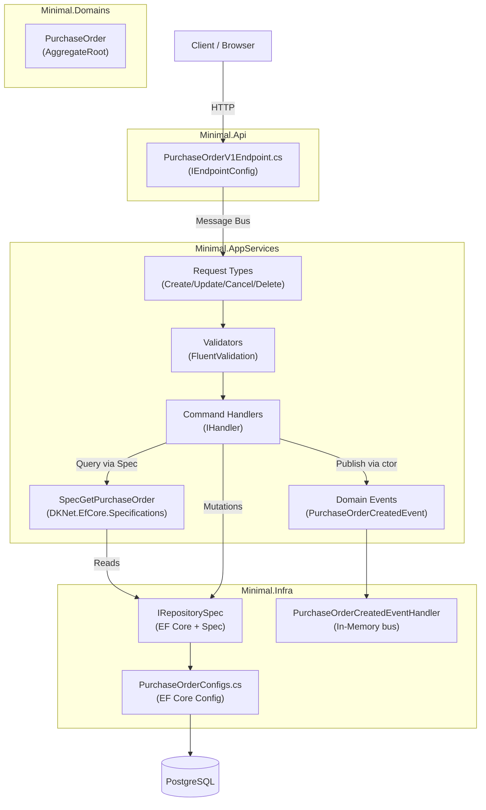
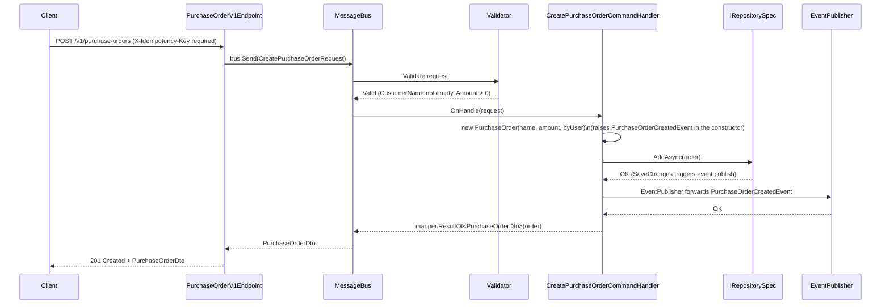
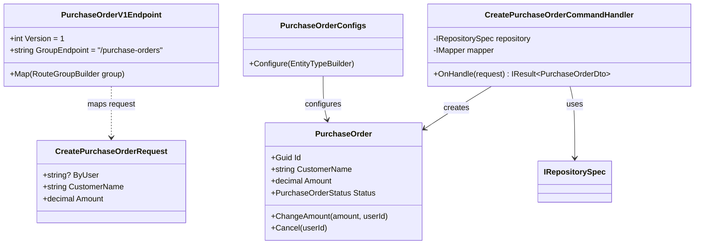
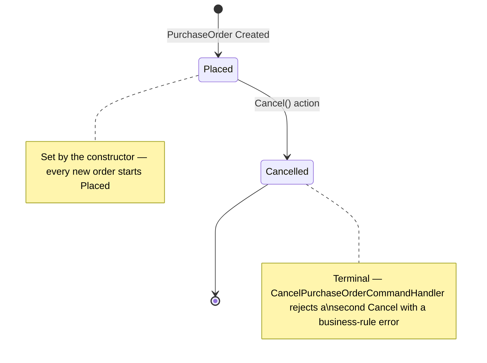
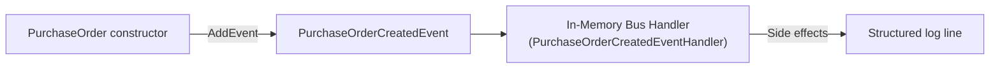
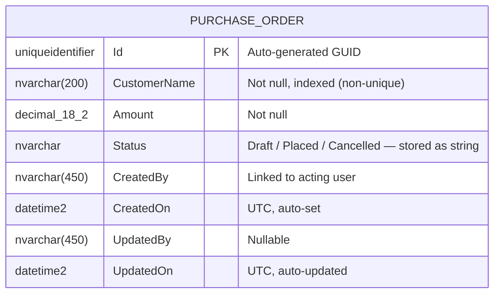
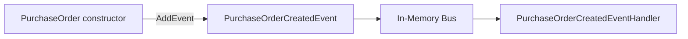

# Skill: Feature Documentation with Diagrams

**Duration**: 30–60 minutes | **Difficulty**: Beginner | **Category**: Documentation & Knowledge Management

---

## Overview

**When to use this skill**: After completing a feature (Domain Modeling → CRUD Operations → API Endpoints). Document it so any developer can understand, maintain, and extend the feature without digging through code.

**What you'll create**: Five structured markdown documents under `docs/features/<feature-name>/`:

| File | Purpose |
|------|---------|
| `README.md` | Overview, purpose, usage summary |
| `architecture.md` | Vertical slice diagram, component responsibilities, data flow |
| `api-reference.md` | All endpoints with request/response examples and curl commands |
| `data-model.md` | Entity diagram, properties, constraints, relationships |
| `events.md` | Domain events catalog with publishers and subscribers |

**Diagram tool**: All diagrams use **Mermaid.js** — rendered natively in GitHub, VS Code Preview, and most wikis. No extra tools required.

**Real examples already in this repo**: this skill is about documenting a *new* feature you just
built, not about the two worked samples that ship with the template — but those samples are the
best current reference for what "good enough to hand to another developer" looks like in this repo:
[`docs/samples/manual-vs-automated.md`](../../../docs/samples/manual-vs-automated.md) (a full
layer-by-layer comparison — the closest thing here to an `architecture.md` + `api-reference.md`
combined) and the two thinner per-sample READMEs,
[`docs/samples/manual-purchase-orders/README.md`](../../../docs/samples/manual-purchase-orders/README.md)
and [`docs/samples/automated-products/README.md`](../../../docs/samples/automated-products/README.md).
Skim those before writing your own — they show the level of detail and the "what does the developer
give up" framing this repo expects, even though their file layout doesn't follow the five-document
structure below.

---

## Prerequisites: Do You Know This?

- [ ] Feature is implemented (Domain Entity, CRUD handlers, endpoints)
- [ ] Comfortable writing markdown
- [ ] Can read C# class definitions and extract relevant info
- [ ] Know what API endpoints were created (HTTP method, route, request/response)

---

## Inputs Checklist

Collect this before you start:

- [ ] **Feature name** (e.g., `PurchaseOrder`, `Product`, `Invoices`)
- [ ] **Purpose**: What business problem does it solve? (1–2 sentences)
- [ ] **Entity properties**: All fields with types and constraints
- [ ] **Entity relationships**: Foreign keys and navigation properties
- [ ] **API endpoints**: HTTP method, route, request/response shape
- [ ] **Domain events**: Names, publishers, subscribers
- [ ] **Business rules**: Validation, uniqueness, state transitions
- [ ] **Status/State model**: Does the entity have status fields? What are the transitions?

---

## Step-by-Step Workflow

### Step 1: Create the Feature Docs Folder

**Convention**: All feature docs must live in `docs/features/<feature-name>/`.

```bash
mkdir -p docs/features/purchase-orders
```

**Naming convention**:
- Folder name: `kebab-case` (e.g., `purchase-orders`, `order-management`)
- File names: lowercase with hyphens (e.g., `api-reference.md`, `data-model.md`)

---

### Step 2: Write README.md (Overview)

**What you're doing**: A self-contained landing page that answers: *what is this feature, why does it exist, and how do I use it?*

**Target audience**: Any developer new to the feature (including your future self).

```markdown
# Purchase Orders

> Manages purchase order lifecycle — creation, amount changes, and cancellation.

## What Is This?

The Purchase Orders feature provides a complete lifecycle for purchase order records — creation,
amount updates, and cancellation. Every layer here is hand-written (no declarative event/CRUD/DTO
generation), which is a deliberate choice documented in `docs/samples/manual-vs-automated.md` — see
that document if you're deciding whether a new feature should be hand-written like this one or
generator-driven like `AutomatedSample/Product`.

## Why Does It Exist?

Purchase orders are the transactional record between a customer and the business. This feature
enables:
- Purchase order creation via REST API, with idempotent retries
- Amount correction after creation
- Cancellation, with a business rule blocking a double-cancel

## Quick Start

### Create a Purchase Order

```http
POST /v1/purchase-orders
Content-Type: application/json
Authorization: Bearer {token}
X-Idempotency-Key: 6e6f4d3c-1b7e-4c7a-9f1d-8a2b5c6d7e01

{
  "customerName": "Acme Pte Ltd",
  "amount": 1250.00
}
```

### Get a Purchase Order

```http
GET /v1/purchase-orders/{id}
Authorization: Bearer {token}
```

## Key Concepts

| Concept | Description |
|---------|-------------|
| **Status** | Lifecycle state: created as `Placed`, transitions only to `Cancelled` |
| **ByUser** | The authenticated user who created/modified the record — bound via `[FromClaim(ClaimTypes.Name)]`, never trusted from the request body |
| **Idempotency** | `POST` requires `X-Idempotency-Key`; replaying the same key returns the original response instead of creating a duplicate |
| **Cancel guard** | Cancelling an already-cancelled order fails with a business-rule error instead of silently succeeding |

## Feature Map

```
Domain Modeling   → Minimal.Domains/Features/ManualSample/Entities/PurchaseOrder.cs
EF Mapping        → Minimal.Infra/Features/ManualSample/Mappers/PurchaseOrderConfigs.cs
CRUD/Actions      → Minimal.AppServices/ManualSample/V1/Actions/
Queries           → Minimal.AppServices/ManualSample/V1/Queries/
Domain Events     → Minimal.AppServices/ManualSample/V1/Events/
API Endpoints     → Minimal.Api/ApiEndpoints/ManualSample/PurchaseOrderV1Endpoint.cs
```

## Related Documentation

- [Architecture](./architecture.md)
- [API Reference](./api-reference.md)
- [Data Model](./data-model.md)
- [Domain Events](./events.md)
```

---

### Step 3: Write architecture.md (Diagrams + Data Flow)

**What you're doing**: Show how the feature is structured across layers with a vertical slice diagram. Use Mermaid for all diagrams.

**Five diagrams to include**:

1. **Vertical Slice Overview** — All layers and their responsibilities
2. **Request Sequence Diagram** — How a POST (create) flows through the system
3. **Component Diagram** — Classes/files and their relationships
4. **State Diagram** — Status transitions (if entity has status field)
5. **Event Flow Diagram** — Domain events and consumers

````markdown
# Purchase Orders — Architecture

## Vertical Slice Overview

This feature follows the DKNet vertical slice architecture.
Each slice is self-contained: it owns its entity, handlers, specs, and events.



## Create Purchase Order — Sequence Diagram



## Component Diagram



## Status State Machine



`PurchaseOrderStatus` also declares a `Draft` value for future use — no current action transitions
an order into or out of it. Document only the transitions actual handler code performs; don't
document an enum member as reachable just because it exists.

## Event Flow



This feature has no external Azure Service Bus wiring — that's the `AutomatedSample/Product`
sample's demonstration instead (see `docs/samples/manual-vs-automated.md`).

## Layer Responsibilities

| Layer | Responsibility in this feature |
|-------|-------------------------------|
| `Minimal.Api` | Route mapping only; no business logic |
| `Minimal.AppServices` | Command handling, validation, event publishing |
| `Minimal.Domains` | Entity state, domain rules, invariants |
| `Minimal.Infra` | Persistence, EF Core config, message bus setup |
````

---

### Step 4: Write api-reference.md (Endpoint Reference)

**What you're doing**: Full endpoint documentation with curl examples, request/response schemas, and error codes.

````markdown
# Purchase Orders — API Reference

**Base Path**: `/v1/purchase-orders`
**Auth**: Bearer token required on all endpoints
**Content-Type**: `application/json`

---

## Endpoints Summary

| Method | Path | Description | Request Type | Idempotency |
|--------|------|-------------|--------------|-------------|
| `GET` | `/` | List purchase orders (paginated, optional customer-name filter) | Query params | — |
| `GET` | `/{id}` | Get purchase order by ID | Route param | — |
| `POST` | `/` | Create new purchase order | Body (JSON) | ✓ `X-Idempotency-Key` required |
| `PUT` | `/{id}` | Update purchase order amount | Body (JSON) | — |
| `POST` | `/{id}/cancel` | Cancel purchase order | Route param only | — |
| `DELETE` | `/{id}` | Delete purchase order | Route param | — |

---

## GET /v1/purchase-orders

Returns a paginated list of purchase orders, optionally filtered by customer name.

**Query Parameters**

| Parameter | Type | Default | Description |
|-----------|------|---------|-------------|
| `pageIndex` | int | 1 | Page number (1-based) |
| `pageSize` | int | 20 | Items per page |
| `customerName` | string | — | Exact-match filter by customer name |

**Response** `200 OK` — a paged list of `PurchaseOrderDto`.

**curl Example**

```bash
curl -X GET "https://localhost:5001/v1/purchase-orders?pageSize=10&customerName=Acme%20Pte%20Ltd" \
  -H "Authorization: Bearer {token}"
```

---

## GET /v1/purchase-orders/{id}

Returns a single purchase order by ID.

**Response** `200 OK`

```json
{
  "id": "6e6f4d3c-1b7e-4c7a-9f1d-8a2b5c6d7e01",
  "customerName": "Acme Pte Ltd",
  "amount": 1250.00,
  "status": "Placed",
  "createdBy": "system"
}
```

**Error Responses**

| Status | Reason |
|--------|--------|
| `404 Not Found` | No purchase order with this ID |

---

## POST /v1/purchase-orders

Creates a new purchase order. **Requires** an idempotency key header — a replayed key returns the
original response instead of creating a duplicate.

**Request Body**

```json
{
  "customerName": "Acme Pte Ltd",
  "amount": 1250.00
}
```

| Field | Type | Required | Rules |
|-------|------|----------|-------|
| `customerName` | string | ✓ | 1–200 characters (FluentValidation, enforced) |
| `amount` | decimal | ✓ | Must be greater than 0 (FluentValidation, enforced) |

`byUser` is never a request field — it's bound server-side from the authenticated caller's claims.

**Response** `201 Created` — a `PurchaseOrderDto` with `status: "Placed"`.

**Error Responses**

| Status | Reason |
|--------|--------|
| `400 Bad Request` | Blank `customerName`, non-positive `amount`, or missing `X-Idempotency-Key` header — all three confirmed live |

**curl Example**

```bash
curl -X POST "https://localhost:5001/v1/purchase-orders" \
  -H "Authorization: Bearer {token}" \
  -H "Content-Type: application/json" \
  -H "X-Idempotency-Key: $(uuidgen)" \
  -d '{"customerName":"Acme Pte Ltd","amount":1250.00}'
```

---

## PUT /v1/purchase-orders/{id}

Changes the amount of an existing purchase order.

**Request Body**

```json
{
  "amount": 1500.00
}
```

| Field | Type | Required | Rules |
|-------|------|----------|-------|
| `amount` | decimal | ✓ | Must be greater than 0 |

**Error Responses**

| Status | Reason |
|--------|--------|
| `404 Not Found` | No purchase order with this ID |

---

## POST /v1/purchase-orders/{id}/cancel

Cancels a purchase order. No request body.

**Response** `200 OK` — a `PurchaseOrderDto` with `status: "Cancelled"`.

**Error Responses**

| Status | Reason |
|--------|--------|
| `404 Not Found` | No purchase order with this ID |
| `400 Bad Request` | The order is already cancelled |

---

## DELETE /v1/purchase-orders/{id}

Deletes the purchase order.

**Response** `200 OK`

**Error Responses**

| Status | Reason |
|--------|--------|
| `404 Not Found` | No purchase order with this ID |

---

## Common Error Response Format

`result.Response()` (from `DKNet.AspCore.Extensions.Responses`) converts a failed `FluentResults`
result into a standard `ProblemDetails` body, with the underlying error messages collected under the
`errors` extension property:

```json
{
  "type": "BadRequest",
  "title": "Error",
  "status": 400,
  "detail": "The purchase order 6e6f4d3c-1b7e-4c7a-9f1d-8a2b5c6d7e01 is already cancelled.",
  "errors": [
    "The purchase order 6e6f4d3c-1b7e-4c7a-9f1d-8a2b5c6d7e01 is already cancelled."
  ]
}
```

A handler that fails with a `NotFoundError` (see `CancelPurchaseOrderCommandHandler`) produces the
same shape with `status: 404`.
````

---

### Step 5: Write data-model.md (Entity Diagram)

**What you're doing**: Document the entity schema, constraints, relationships, and EF Core mapping config.

````markdown
# Purchase Orders — Data Model

## Entity Relationship Diagram



This feature has no related entity table — `PurchaseOrder` is a single-table aggregate with no
owned types or child entities.

## Properties

| Property | C# Type | DB Column | Constraints |
|----------|---------|-----------|-------------|
| `Id` | `Guid` | `Id` (PK) | Not null, auto-generated (`AggregateRoot` base) |
| `CustomerName` | `string` | `CustomerName` | Not null, max 200 chars, non-unique index |
| `Amount` | `decimal` | `Amount` | Not null, precision `(18,2)` |
| `Status` | `PurchaseOrderStatus` (enum) | `Status` | Not null, stored `HasConversion<string>()` |
| `CreatedBy` | `string` | `CreatedBy` | Not null — set from `[FromClaim(ClaimTypes.Name)] ByUser` at create |
| `CreatedOn` | `DateTimeOffset` | `CreatedOn` | UTC, auto-set on insert (`AuditedEntity` base) |
| `UpdatedBy` | `string?` | `UpdatedBy` | Nullable, set by `ChangeAmount`/`Cancel` via `SetUpdatedBy` |
| `UpdatedOn` | `DateTimeOffset?` | `UpdatedOn` | Nullable, auto-updated on mutation |

## EF Core Mapping Configuration

See `Minimal.Infra/Features/ManualSample/Mappers/PurchaseOrderConfigs.cs` for the full config.

Key mapping decisions:
- **Table name**: `PurchaseOrders` (schema: `manual_sample`, a literal string — not a `DomainSchemas` constant)
- **Index**: non-unique index on `CustomerName` (a query-performance index, not a business uniqueness rule — contrast with `AutomatedSample/Product`'s *unique* index on `Name`)
- **Enum storage**: `Status` uses `HasConversion<string>()` so the raw table stores `"Placed"`/`"Cancelled"`, not an integer
- **Seed data**: 3 fixed-`Guid` rows via `PurchaseOrderStaticData` (`DataSeedingConfiguration<PurchaseOrder>`) — see `dknet-efcore-config` for the seeding-wiring gotcha this template hit once

## Validation Rules

| Rule | Details |
|------|---------|
| `CustomerName` required, 1–200 chars | Enforced by FluentValidation (`CreatePurchaseOrderCommandValidator`) |
| `Amount` must be > 0 | Enforced by FluentValidation on both Create and Update |
| Cancel is terminal | `Cancel` on an order already `Cancelled` fails in the handler with a business-rule error, not a domain-entity exception |
| Idempotent create | `X-Idempotency-Key` header required on `POST` — enforced at the endpoint, not the entity |
````

---

### Step 6: Write events.md (Domain Events Catalog)

**What you're doing**: Catalog all domain events published and consumed by this feature so other teams know how to subscribe.

````markdown
# Purchase Orders — Domain Events

## Events Published

### PurchaseOrderCreatedEvent

Raised inside the `PurchaseOrder` constructor, immediately when a new purchase order is created —
by hand (`AddEvent(...)`), not by a declarative attribute. See `dknet-ddd-principles` for the
hand-raised-vs-declared contrast (`AutomatedSample/Product` uses the declared alternative).

**Published by**: `PurchaseOrder`'s constructor (called from `CreatePurchaseOrderCommandHandler`)

**Payload**

```csharp
public sealed record PurchaseOrderCreatedEvent(Guid Id, string CustomerName, decimal Amount);
```

| Property | Type | Description |
|----------|------|-------------|
| `Id` | `Guid` | The newly created purchase order's ID |
| `CustomerName` | `string` | The customer name on the order |
| `Amount` | `decimal` | The order amount at creation time |

**Subscribers**

| Subscriber | Bus | Action |
|-----------|-----|--------|
| `PurchaseOrderCreatedEventHandler` | In-Memory | Logs at Information level |

This feature has no external Azure Service Bus subscriber — that demonstration lives in the
`AutomatedSample/Product` sample instead (see `docs/samples/manual-vs-automated.md`).

**Example Usage** — subscribing to this event:

```csharp
internal sealed class PurchaseOrderCreatedEventHandler(ILogger<PurchaseOrderCreatedEventHandler> logger)
    : Fluents.EventsConsumers.IHandler<PurchaseOrderCreatedEvent>
{
    public Task OnHandle(PurchaseOrderCreatedEvent notification, CancellationToken cancellationToken)
    {
        logger.LogInformation("Purchase order created: {PurchaseOrderId}", notification.Id);
        return Task.CompletedTask;
    }
}
```

---

## Events Consumed

This feature does not currently consume events from other features.

---

## Event Bus Configuration

- **In-Memory bus**: Always active. Used for local handlers in the same process — this is the only
  bus `PurchaseOrder`'s event reaches.
- **Azure Service Bus**: Active when `ConnectionStrings:AzureBus` is configured — not wired for this
  feature; see `Product`'s `ProductCreatedEvent` for the pattern if a future change needs it.

See `Minimal.Infra/Extensions/ServiceBusSetup.cs` for the bus wiring.


````

---

## Document Naming Conventions

| Document | File Name | Description |
|----------|-----------|-------------|
| Overview + quick start | `README.md` | Always required |
| Architecture + diagrams | `architecture.md` | Required when using vertical slices |
| API endpoint reference | `api-reference.md` | Required for any REST-exposed feature |
| Entity + data model | `data-model.md` | Required for any persisted entity |
| Domain events | `events.md` | Required when events are published/consumed |
| Configuration guide | `configuration.md` | Optional — for features with settings/flags |
| ADR (decision records) | `decisions/adr-001-*.md` | Optional — when major tradeoffs were made |

---

## Mermaid Diagram Types Reference

Use appropriate Mermaid diagram types for different aspects:

| Diagram type | Mermaid keyword | When to use |
|-------------|-----------------|-------------|
| Component flow | `graph TD` / `graph LR` | Overview of layers, event flows |
| Request sequence | `sequenceDiagram` | How a specific API call flows step-by-step |
| Entity classes | `classDiagram` | Class relationships and properties |
| Entity-Relation | `erDiagram` | Database table structure |
| State machine | `stateDiagram-v2` | Status transitions |
| Timeline | `timeline` | Feature evolution, release history |

**All Mermaid diagrams are fenced code blocks**:

````md

````

They render automatically on GitHub, GitLab, VS Code (Markdown Preview), Docusaurus, and most modern wikis.

---

## Feature Docs Folder Structure

```
docs/
└── features/
    └── purchase-orders/          ← kebab-case folder name
        ├── README.md             ← Overview (START HERE)
        ├── architecture.md       ← Diagrams + vertical slice
        ├── api-reference.md      ← Endpoints + examples + curl
        ├── data-model.md         ← Entity diagram + constraints
        ├── events.md             ← Domain events + subscribers
        └── decisions/            ← Optional ADRs
            └── adr-001-idempotency-key-strategy.md
```
