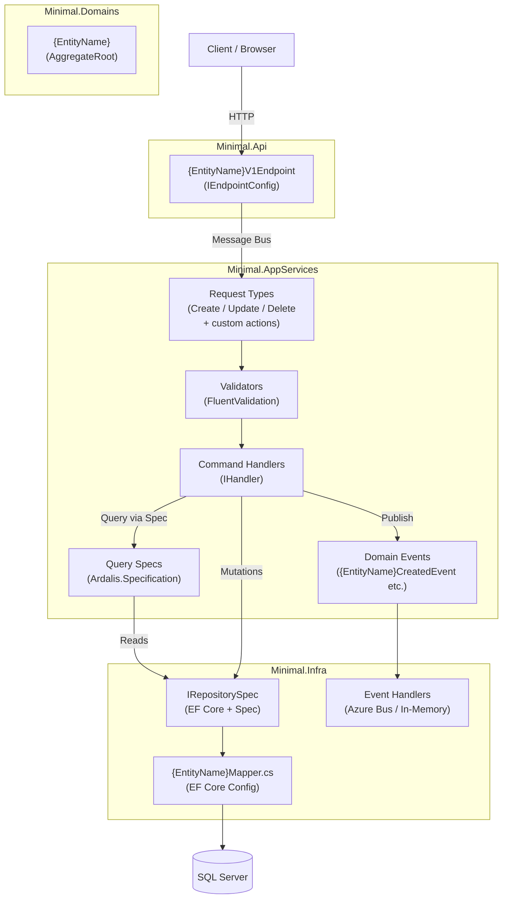
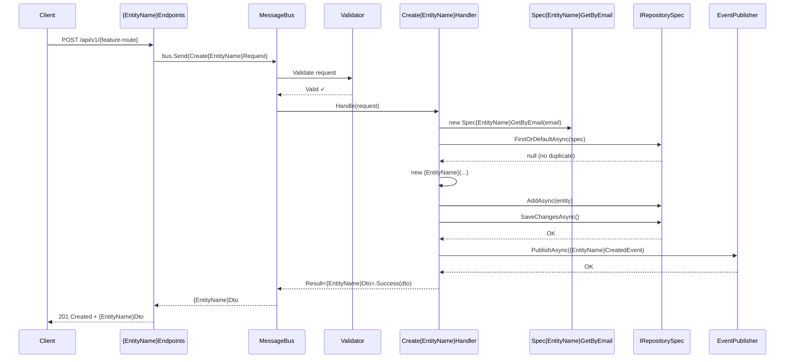
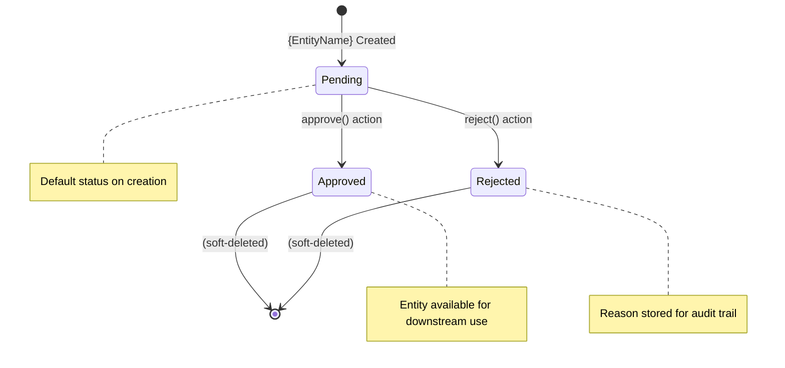
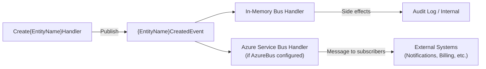

# {FeatureName} — Architecture

## Vertical Slice Overview

This feature follows the DKNet vertical slice architecture.
Each layer has a single, focused responsibility for this feature.



## Create {EntityName} — Sequence Diagram



## Component Diagram

```mermaid
classDiagram
    class {EntityName}V1Endpoint {
        +int Version = 1
        +string GroupEndpoint = "/{feature-route}"
        +Map(RouteGroupBuilder group)
    }

    class Create{EntityName}Request {
        +string Field1
        +string Field2
    }

    class Create{EntityName}CommandHandler {
        -IMapper _mapper
        -IRepositorySpec _repo
        -IEventPublisher _eventPublisher
        +Handle(request) Result~{EntityName}Dto~
    }

    class {EntityName} {
        +Guid Id
        +string Field1
        +string Field2
        +string Status
        +Approve(reason)
        +Reject(reason)
        +Update(...)
    }

    class {EntityName}Mapper {
        +Configure(EntityTypeBuilder)
    }

    {EntityName}V1Endpoint ..> Create{EntityName}Request : maps request
    Create{EntityName}CommandHandler --> {EntityName} : creates
    Create{EntityName}CommandHandler --> IRepositorySpec : uses
    {EntityName}Mapper --> {EntityName} : configures
```

## Status State Machine

> Remove this section if the entity has no status/approval workflow.



## Event Flow



## Layer Responsibilities

| Layer | Responsibility in this feature |
|-------|-------------------------------|
| `Minimal.Api` | Route mapping only; zero business logic |
| `Minimal.AppServices` | Command handling, validation, event publishing |
| `Minimal.Domains` | Entity state, domain rules, invariants |
| `Minimal.Infra` | Persistence, EF Core config, message bus setup |
