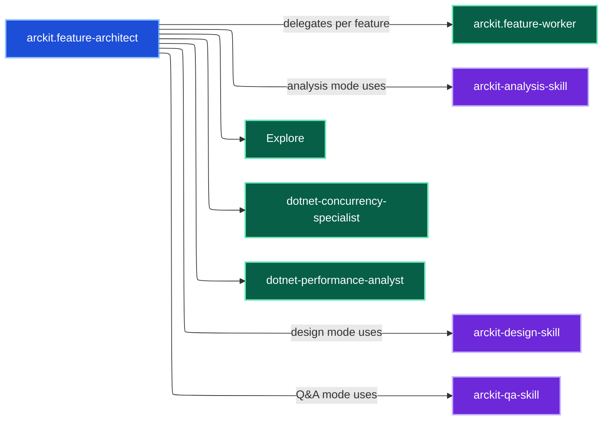
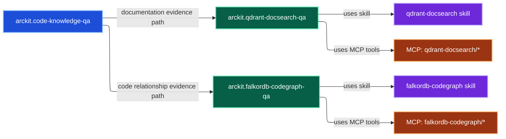
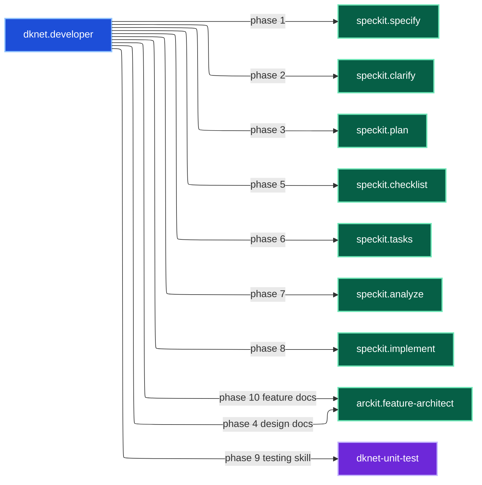
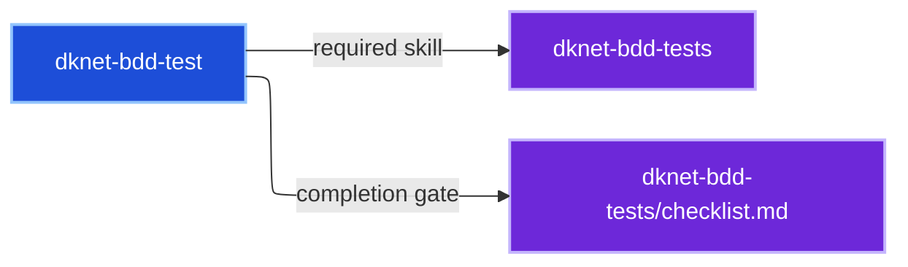

# Agent Relationship Map (Arckit + DKNet)

This document maps `arckit` and `dknet` agents with separate diagrams per agent.

## arckit.feature-architect

## arckit.code-knowledge-qa

## dknet.developer

## dknet-bdd-test

## dknet.efcore-config

## Notes

- `dknet.developer` orchestrates Spec-Kit phases and delegates architecture phases to `arckit.feature-architect`.
- `arckit.feature-architect` delegates per-feature execution to `arckit.feature-worker` and applies `arckit-analysis-skill`, `arckit-design-skill`, and `arckit-qa-skill`.
- `arckit.code-knowledge-qa` combines documentation-intent and code-relationship evidence paths through `arckit.qdrant-docsearch-qa` and `arckit.falkordb-codegraph-qa`.
- MCP-backed workers are `arckit.qdrant-docsearch-qa` (`qdrant-docsearch/*`) and `arckit.falkordb-codegraph-qa` (`falkordb-codegraph/*`), with skills `qdrant-docsearch` and `falkordb-codegraph`.
- `dknet-bdd-test` explicitly requires the `dknet-bdd-tests` skill and its checklist gate.
- `dknet.efcore-config` explicitly requires the `dknet-efcore-config` skill.

## Future Update Requirements

- Keep a consistent color system across all Mermaid diagrams:
  - agent = blue
  - subagent = green
  - skill = purple
  - mcp = orange
- Keep standalone diagram sections for user-invocable agents.
- Include sub-agent relationships inside parent diagrams where relevant.
- For any sub-agent shown, include linked skills and MCP tool names when available.
- Keep `dknet.efcore-config` linked to `dknet-efcore-config skill`.
- Do not label nodes with "internal sub-agent" wording in diagram labels.
