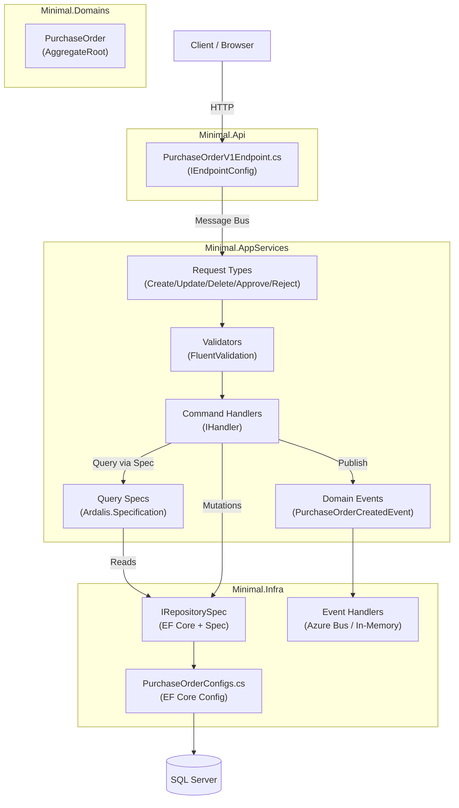
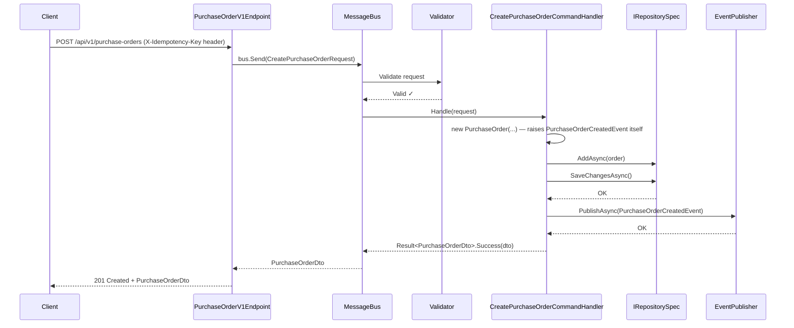
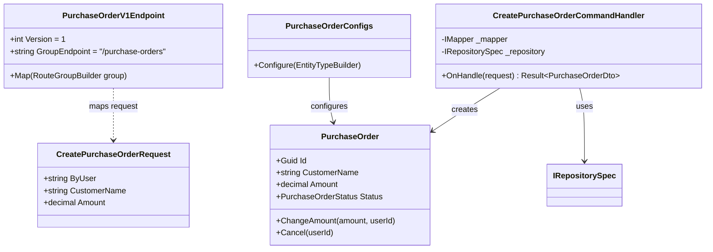
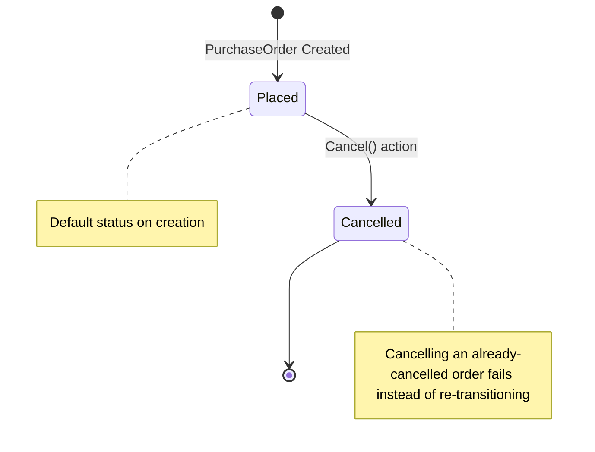
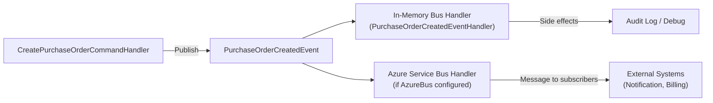
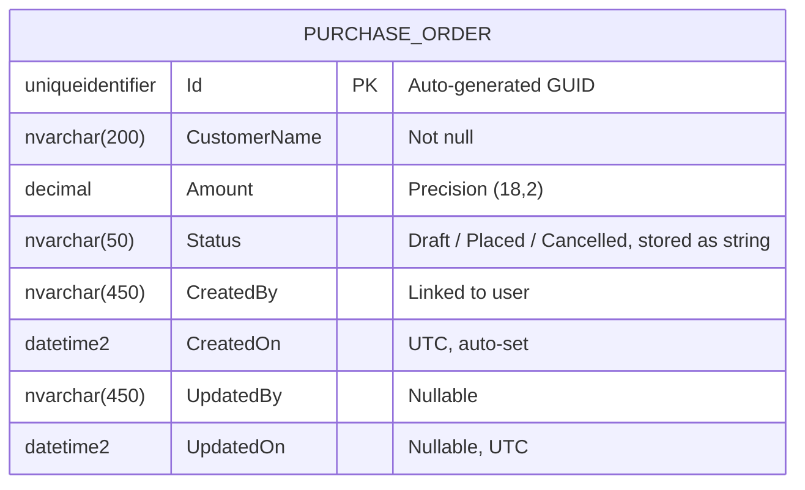
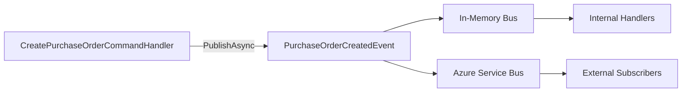

# Skill: Feature Documentation with Diagrams

**Duration**: 30–60 minutes | **Difficulty**: Beginner | **Category**: Documentation & Knowledge Management

---

## Overview

**When to use this skill**: After completing a feature (Domain Modeling → CRUD Operations → API Endpoints). Document it so any developer can understand, maintain, and extend the feature without digging through code.

**What you'll create**: Five structured markdown documents under `docs/features/<feature-name>/`:

| File | Purpose |
|------|---------|
| `README.md` | Overview, purpose, usage summary |
| `architecture.md` | Vertical slice diagram, component responsibilities, data flow |
| `api-reference.md` | All endpoints with request/response examples and curl commands |
| `data-model.md` | Entity diagram, properties, constraints, relationships |
| `events.md` | Domain events catalog with publishers and subscribers |

**Diagram tool**: All diagrams use **Mermaid.js** — rendered natively in GitHub, VS Code Preview, and most wikis. No extra tools required.

---

## Prerequisites: Do You Know This?

- [ ] Feature is implemented (Domain Entity, CRUD handlers, endpoints)
- [ ] Comfortable writing markdown
- [ ] Can read C# class definitions and extract relevant info
- [ ] Know what API endpoints were created (HTTP method, route, request/response)

---

## Inputs Checklist

Collect this before you start:

- [ ] **Feature name** (e.g., `PurchaseOrder`, `Orders`, `Invoices`)
- [ ] **Purpose**: What business problem does it solve? (1–2 sentences)
- [ ] **Entity properties**: All fields with types and constraints
- [ ] **Entity relationships**: Foreign keys and navigation properties
- [ ] **API endpoints**: HTTP method, route, request/response shape
- [ ] **Domain events**: Names, publishers, subscribers
- [ ] **Business rules**: Validation, uniqueness, state transitions
- [ ] **Status/State model**: Does the entity have status fields? What are the transitions?

---

## Step-by-Step Workflow

### Step 1: Create the Feature Docs Folder

**Convention**: All feature docs must live in `docs/features/<feature-name>/`.

```bash
mkdir -p docs/features/purchase-orders
```

**Naming convention**:
- Folder name: `kebab-case` (e.g., `purchase-orders`, `order-management`)
- File names: lowercase with hyphens (e.g., `api-reference.md`, `data-model.md`)

---

### Step 2: Write README.md (Overview)

**What you're doing**: A self-contained landing page that answers: *what is this feature, why does it exist, and how do I use it?*

**Target audience**: Any developer new to the feature (including your future self).

```markdown
# Purchase Orders

> Manages the lifecycle of a customer's purchase order — creation, amount changes, and cancellation.

## What Is This?

The Purchase Orders feature provides a complete lifecycle for purchase-order records — creation,
amount updates, and cancellation. Every order carries the identity of the user who created or last
changed it.

## Why Does It Exist?

Purchase orders are the entry point for a customer's spend in the system. This feature enables:
- Order creation via REST API, protected by an idempotency key so a client retry can't create a duplicate
- Amount correction after creation
- Cancellation, which is rejected if the order is already cancelled

## Quick Start

### Create a Purchase Order

```http
POST /api/v1/purchase-orders
Content-Type: application/json
Authorization: Bearer {token}
X-Idempotency-Key: 6e6f4d3c-1b7e-4c7a-9f1d-8a2b5c6d7e01

{
  "customerName": "Acme Pte Ltd",
  "amount": 1250.00
}
```

### Get a Purchase Order

```http
GET /api/v1/purchase-orders/{id}
Authorization: Bearer {token}
```

## Key Concepts

| Concept | Description |
|---------|-------------|
| **Status** | Lifecycle state: `Draft → Placed → Cancelled` |
| **ByUser** | The authenticated user who created/modified the record, via `[FromClaim(ClaimTypes.Name)]` |
| **Idempotency** | `POST` requires an `X-Idempotency-Key` header; a replayed key returns the original response instead of creating a duplicate |
| **Cancellation guard** | Cancelling an already-cancelled order fails with a business-rule error instead of silently succeeding |

## Feature Map

```
Domain Modeling   → Minimal.Domains/Features/ManualSample/Entities/PurchaseOrder.cs
EF Mapping        → Minimal.Infra/Features/ManualSample/Mappers/PurchaseOrderConfigs.cs
CRUD Handlers     → Minimal.AppServices/ManualSample/V1/Actions/
Domain Events     → Minimal.AppServices/ManualSample/V1/Events/
API Endpoints     → Minimal.Api/ApiEndpoints/ManualSample/PurchaseOrderV1Endpoint.cs
```

## Related Documentation

- [Architecture](./architecture.md)
- [API Reference](./api-reference.md)
- [Data Model](./data-model.md)
- [Domain Events](./events.md)
```

---

### Step 3: Write architecture.md (Diagrams + Data Flow)

**What you're doing**: Show how the feature is structured across layers with a vertical slice diagram. Use Mermaid for all diagrams.

**Five diagrams to include**:

1. **Vertical Slice Overview** — All layers and their responsibilities
2. **Request Sequence Diagram** — How a POST (create) flows through the system
3. **Component Diagram** — Classes/files and their relationships
4. **State Diagram** — Status transitions (if entity has status field)
5. **Event Flow Diagram** — Domain events and consumers

````markdown
# Purchase Orders — Architecture

## Vertical Slice Overview

This feature follows the DKNet vertical slice architecture.
Each slice is self-contained: it owns its entity, handlers, specs, and events.



## Create Purchase Order — Sequence Diagram



## Component Diagram



## Status State Machine



## Event Flow



## Layer Responsibilities

| Layer | Responsibility in this feature |
|-------|-------------------------------|
| `Minimal.Api` | Route mapping only; no business logic |
| `Minimal.AppServices` | Command handling, validation, event publishing |
| `Minimal.Domains` | Entity state, domain rules, invariants |
| `Minimal.Infra` | Persistence, EF Core config, message bus setup |
````

---

### Step 4: Write api-reference.md (Endpoint Reference)

**What you're doing**: Full endpoint documentation with curl examples, request/response schemas, and error codes.

````markdown
# Purchase Orders — API Reference

**Base Path**: `/api/v1/purchase-orders`
**Auth**: Bearer token required on all endpoints
**Content-Type**: `application/json`

---

## Endpoints Summary

| Method | Path | Description | Request Type | Auth Required |
|--------|------|-------------|--------------|---------------|
| `GET` | `/` | List purchase orders (paginated, optional customer-name filter) | Query params | ✓ |
| `GET` | `/{id}` | Get purchase order by ID | Route param | ✓ |
| `POST` | `/` | Create new purchase order (idempotency key required) | Body (JSON) | ✓ |
| `PUT` | `/{id}` | Update purchase order amount | Body (JSON) | ✓ |
| `POST` | `/{id}/cancel` | Cancel purchase order | Route param | ✓ |
| `DELETE` | `/{id}` | Delete purchase order | Route param | ✓ |

---

## GET /api/v1/purchase-orders

Returns a paginated list of purchase orders.

**Query Parameters**

| Parameter | Type | Default | Description |
|-----------|------|---------|-------------|
| `pageIndex` | int | 1 | Page number (1-based) |
| `pageSize` | int | 20 | Items per page |
| `customerName` | string | — | Filter by customer name |

**Response** `200 OK`

```json
{
  "items": [
    {
      "id": "6e6f4d3c-1b7e-4c7a-9f1d-8a2b5c6d7e01",
      "customerName": "Acme Pte Ltd",
      "amount": 1250.00,
      "status": "Placed",
      "createdBy": "system"
    }
  ],
  "pageIndex": 1,
  "pageSize": 20
}
```

**curl Example**

```bash
curl -X GET "https://api.example.com/api/v1/purchase-orders?pageSize=10&customerName=Acme" \
  -H "Authorization: Bearer {token}"
```

---

## GET /api/v1/purchase-orders/{id}

Returns a single purchase order by ID.

**Response** `200 OK`

```json
{
  "id": "6e6f4d3c-1b7e-4c7a-9f1d-8a2b5c6d7e01",
  "customerName": "Acme Pte Ltd",
  "amount": 1250.00,
  "status": "Placed",
  "createdBy": "system"
}
```

**Error Responses**

| Status | Reason |
|--------|--------|
| `404 Not Found` | No purchase order with this ID |

---

## POST /api/v1/purchase-orders

Creates a new purchase order. Requires an `X-Idempotency-Key` header — a replayed key returns the original response instead of creating a duplicate.

**Request Body**

```json
{
  "customerName": "Acme Pte Ltd",
  "amount": 1250.00
}
```

| Field | Type | Required | Rules |
|-------|------|----------|-------|
| `customerName` | string | ✓ | 1–200 characters |
| `amount` | decimal | ✓ | Greater than 0 |

**Response** `201 Created`

```json
{
  "id": "6e6f4d3c-1b7e-4c7a-9f1d-8a2b5c6d7e01",
  "customerName": "Acme Pte Ltd",
  "amount": 1250.00,
  "status": "Placed",
  "createdBy": "jane.doe"
}
```

**Error Responses**

| Status | Reason |
|--------|--------|
| `400 Bad Request` | Validation failure (blank customer name, non-positive amount) or missing `X-Idempotency-Key` header |

**curl Example**

```bash
curl -X POST "https://api.example.com/api/v1/purchase-orders" \
  -H "Authorization: Bearer {token}" \
  -H "Content-Type: application/json" \
  -H "X-Idempotency-Key: $(uuidgen)" \
  -d '{"customerName":"Acme Pte Ltd","amount":1250.00}'
```

---

## PUT /api/v1/purchase-orders/{id}

Updates an existing purchase order's amount.

**Request Body**

```json
{
  "amount": 1500.00
}
```

**Error Responses**

| Status | Reason |
|--------|--------|
| `400 Bad Request` | `amount` is not greater than 0 |
| `404 Not Found` | No purchase order with this ID |

---

## POST /api/v1/purchase-orders/{id}/cancel

Cancels a purchase order.

**Response** `200 OK` — Returns the updated `PurchaseOrderDto` with `status: "Cancelled"`.

**Error Responses**

| Status | Reason |
|--------|--------|
| `400 Bad Request` | The order is already cancelled |
| `404 Not Found` | No purchase order with this ID |

---

## DELETE /api/v1/purchase-orders/{id}

Deletes the purchase order.

**Response** `200 OK`

**Error Responses**

| Status | Reason |
|--------|--------|
| `404 Not Found` | No purchase order with this ID |

---

## Common Error Response Format

All errors return a `ProblemDetails`-shaped structure:

```json
{
  "type": "https://tools.ietf.org/html/rfc9110#section-15.5.1",
  "title": "Validation Error",
  "status": 400,
  "detail": "One or more validation errors occurred.",
  "errors": {
    "customerName": ["'Customer Name' must not be empty."],
    "amount": ["'Amount' must be greater than '0'."]
  }
}
```
````

---

### Step 5: Write data-model.md (Entity Diagram)

**What you're doing**: Document the entity schema, constraints, relationships, and EF Core mapping config.

````markdown
# Purchase Orders — Data Model

## Entity Relationship Diagram



## Properties

| Property | C# Type | DB Column | Constraints |
|----------|---------|-----------|-------------|
| `Id` | `Guid` | `Id` (PK) | Not null, generated in the constructor via `Guid.NewGuid()` |
| `CustomerName` | `string` | `CustomerName` | Not null, max 200 chars, indexed (not unique) |
| `Amount` | `decimal` | `Amount` | Precision `(18,2)`, must be greater than 0 |
| `Status` | `PurchaseOrderStatus` | `Status` | Stored as string via `.HasConversion<string>()`; `Draft`/`Placed`/`Cancelled` |
| `CreatedBy` | `string` | `CreatedBy` | Not null, set from `[FromClaim(ClaimTypes.Name)] ByUser` |
| `UpdatedBy` | `string?` | `UpdatedBy` | Nullable, set by `SetUpdatedBy(userId)` on mutation |

## EF Core Mapping Configuration

See `Minimal.Infra/Features/ManualSample/Mappers/PurchaseOrderConfigs.cs` for the full config.

Key mapping decisions:
- **Table name**: `PurchaseOrders` (schema: `manual_sample`)
- **Index**: `CustomerName` (not unique — several orders can share a customer name)
- **Enum storage**: `Status` stored as `string`, not the underlying `int`
- **Precision**: `Amount` uses `HasPrecision(18, 2)`

## Validation Rules

| Rule | Details |
|------|---------|
| `CustomerName` required | `[Required][StringLength(200, MinimumLength = 1)]` on the create request + `NotEmpty().Length(1, 200)` FluentValidation rule |
| `Amount` positive | `GreaterThan(0)` FluentValidation rule on both create and update requests |
| Cancel is idempotent-unsafe by design | Cancelling an already-`Cancelled` order fails with a business-rule error rather than succeeding a second time (enforced in the command handler, see `dknet-ddd-principles`) |
````

---

### Step 6: Write events.md (Domain Events Catalog)

**What you're doing**: Catalog all domain events published and consumed by this feature so other teams know how to subscribe.

````markdown
# Purchase Orders — Domain Events

## Events Published

### PurchaseOrderCreatedEvent

Raised by hand from `PurchaseOrder`'s own constructor (`AddEvent(new PurchaseOrderCreatedEvent(Id, CustomerName, Amount))`), immediately when a new order is constructed — not in the handler.

**Published by**: `PurchaseOrder` constructor (via `AddEvent`), delivered by `Minimal.Infra/Services/EventPublisher.cs` after `SaveChangesAsync`

**Payload**

```csharp
public sealed record PurchaseOrderCreatedEvent(Guid Id, string CustomerName, decimal Amount);
```

| Property | Type | Description |
|----------|------|-------------|
| `Id` | `Guid` | The newly created order's ID |
| `CustomerName` | `string` | The order's customer name |
| `Amount` | `decimal` | The order amount |

**Subscribers**

| Subscriber | Bus | Action |
|-----------|-----|--------|
| `PurchaseOrderCreatedEventHandler` | In-Memory | Logs the event at Information level |

*(For an entity that instead declares `[RaisesEvent(...)]` rather than calling `AddEvent` by hand — see `Product` — the event is raised by DKNet's EF Core save hook instead of application code; only the consumer above is still hand-written. `Product`'s declared events are also consumed externally over Azure Service Bus — see `ProductCreatedNotificationHandler` for that pattern if this feature needs one too.)*

**Example Usage** — subscribing to this event:

```csharp
internal sealed class LogPurchaseOrderCreatedHandler(ILogger<LogPurchaseOrderCreatedHandler> logger) :
    Fluents.EventsConsumers.IHandler<PurchaseOrderCreatedEvent>
{
    public Task OnHandle(PurchaseOrderCreatedEvent notification, CancellationToken cancellationToken)
    {
        logger.LogInformation("Purchase order {Id} created for {CustomerName}.", notification.Id, notification.CustomerName);
        return Task.CompletedTask;
    }
}
```

---

## Events Consumed

This feature does not currently consume events from other features.

---

## Event Bus Configuration

- **In-Memory bus**: Always active. Used for local handlers in the same process.
- **Azure Service Bus**: Active when `ConnectionStrings:AzureBus` is configured in `appsettings.json`.

See `Minimal.Infra/Extensions/ServiceBusSetup.cs` for the bus wiring.


````

---

## Document Naming Conventions

| Document | File Name | Description |
|----------|-----------|-------------|
| Overview + quick start | `README.md` | Always required |
| Architecture + diagrams | `architecture.md` | Required when using vertical slices |
| API endpoint reference | `api-reference.md` | Required for any REST-exposed feature |
| Entity + data model | `data-model.md` | Required for any persisted entity |
| Domain events | `events.md` | Required when events are published/consumed |
| Configuration guide | `configuration.md` | Optional — for features with settings/flags |
| ADR (decision records) | `decisions/adr-001-*.md` | Optional — when major tradeoffs were made |

---

## Mermaid Diagram Types Reference

Use appropriate Mermaid diagram types for different aspects:

| Diagram type | Mermaid keyword | When to use |
|-------------|-----------------|-------------|
| Component flow | `graph TD` / `graph LR` | Overview of layers, event flows |
| Request sequence | `sequenceDiagram` | How a specific API call flows step-by-step |
| Entity classes | `classDiagram` | Class relationships and properties |
| Entity-Relation | `erDiagram` | Database table structure |
| State machine | `stateDiagram-v2` | Status transitions |
| Timeline | `timeline` | Feature evolution, release history |

**All Mermaid diagrams are fenced code blocks**:

````md

````

They render automatically on GitHub, GitLab, VS Code (Markdown Preview), Docusaurus, and most modern wikis.

---

## Feature Docs Folder Structure

```
docs/
└── features/
    └── purchase-orders/        ← kebab-case folder name
        ├── README.md             ← Overview (START HERE)
        ├── architecture.md       ← Diagrams + vertical slice
        ├── api-reference.md      ← Endpoints + examples + curl
        ├── data-model.md         ← Entity diagram + constraints
        ├── events.md             ← Domain events + subscribers
        └── decisions/            ← Optional ADRs
            └── adr-001-idempotency-key-strategy.md
```

## Real Reference Material Already in This Repo

Neither of this template's own two worked samples (`PurchaseOrder`/`ManualSample`, `Product`/`AutomatedSample`) has this five-file `docs/features/<feature-name>/` treatment — they're documented instead by:
- [`docs/samples/manual-vs-automated.md`](../../../docs/samples/manual-vs-automated.md) — the authoritative, layer-by-layer comparison of the two samples, closest thing in this repo to an `architecture.md` + `data-model.md` + `events.md` combined
- [`docs/samples/manual-purchase-orders/README.md`](../../../docs/samples/manual-purchase-orders/README.md) and [`docs/samples/automated-products/README.md`](../../../docs/samples/automated-products/README.md) — thin per-sample overviews, the closest thing to a `README.md`

Read those before documenting a *new* feature you've built — they show what "grounded in real code, not invented" looks like for this repo, and are a better model to imitate than any hypothetical example above.
