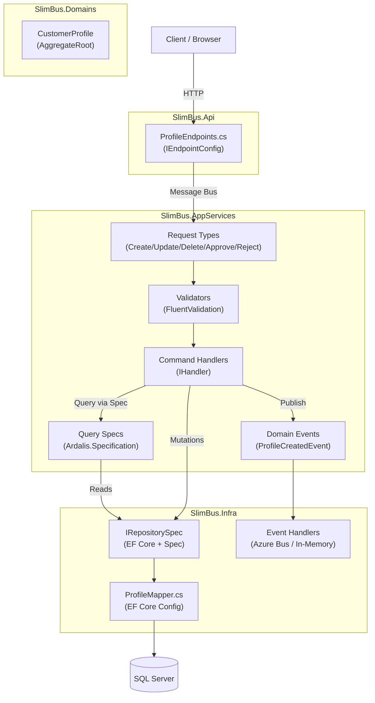
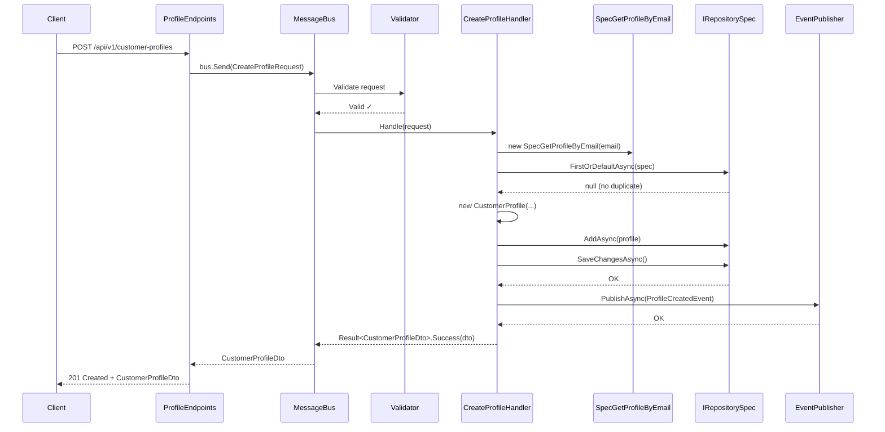
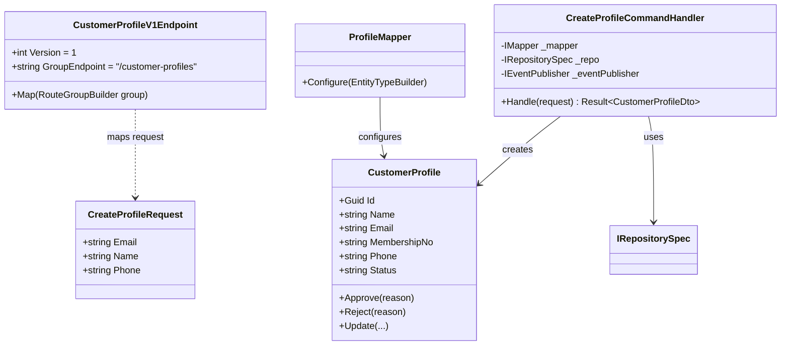
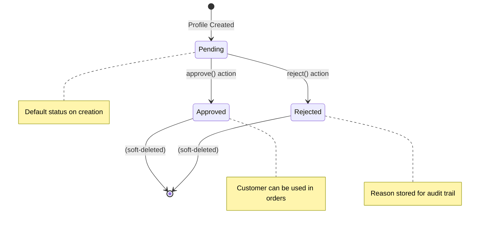
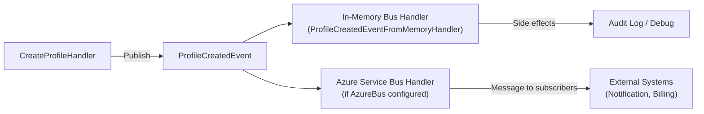
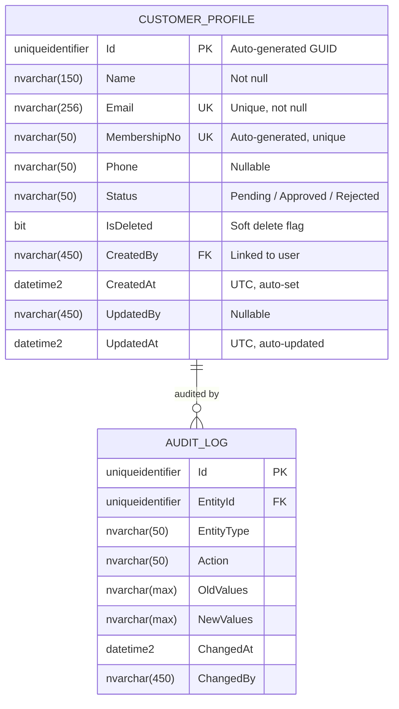
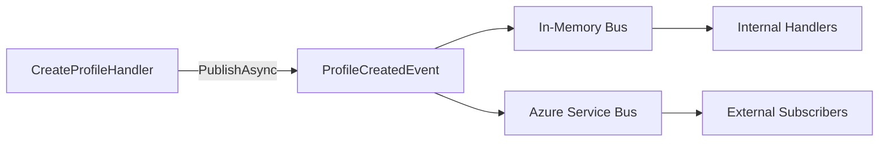

# Skill: Feature Documentation with Diagrams

**Duration**: 30–60 minutes | **Difficulty**: Beginner | **Category**: Documentation & Knowledge Management

---

## Overview

**When to use this skill**: After completing a feature (Domain Modeling → CRUD Operations → API Endpoints). Document it so any developer can understand, maintain, and extend the feature without digging through code.

**What you'll create**: Five structured markdown documents under `docs/features/<feature-name>/`:

| File | Purpose |
|------|---------|
| `README.md` | Overview, purpose, usage summary |
| `architecture.md` | Vertical slice diagram, component responsibilities, data flow |
| `api-reference.md` | All endpoints with request/response examples and curl commands |
| `data-model.md` | Entity diagram, properties, constraints, relationships |
| `events.md` | Domain events catalog with publishers and subscribers |

**Diagram tool**: All diagrams use **Mermaid.js** — rendered natively in GitHub, VS Code Preview, and most wikis. No extra tools required.

---

## Prerequisites: Do You Know This?

- [ ] Feature is implemented (Domain Entity, CRUD handlers, endpoints)
- [ ] Comfortable writing markdown
- [ ] Can read C# class definitions and extract relevant info
- [ ] Know what API endpoints were created (HTTP method, route, request/response)

---

## Inputs Checklist

Collect this before you start:

- [ ] **Feature name** (e.g., `CustomerProfile`, `Orders`, `Invoices`)
- [ ] **Purpose**: What business problem does it solve? (1–2 sentences)
- [ ] **Entity properties**: All fields with types and constraints
- [ ] **Entity relationships**: Foreign keys and navigation properties
- [ ] **API endpoints**: HTTP method, route, request/response shape
- [ ] **Domain events**: Names, publishers, subscribers
- [ ] **Business rules**: Validation, uniqueness, state transitions
- [ ] **Status/State model**: Does the entity have status fields? What are the transitions?

---

## Step-by-Step Workflow

### Step 1: Create the Feature Docs Folder

**Convention**: All feature docs must live in `docs/features/<feature-name>/`.

```bash
mkdir -p docs/features/customer-profiles
```

**Naming convention**:
- Folder name: `kebab-case` (e.g., `customer-profiles`, `order-management`)
- File names: lowercase with hyphens (e.g., `api-reference.md`, `data-model.md`)

---

### Step 2: Write README.md (Overview)

**What you're doing**: A self-contained landing page that answers: *what is this feature, why does it exist, and how do I use it?*

**Target audience**: Any developer new to the feature (including your future self).

```markdown
# Customer Profiles

> Manages customer identity, contact information, and membership accounts.

## What Is This?

The Customer Profiles feature provides a complete lifecycle for customer records — creation,
updates, soft-deletion, and approval workflows. Each profile is linked to a user account
and carries a unique auto-generated membership number.

## Why Does It Exist?

Customer profiles are the central entity in the system. All orders, invoices, and
communications are linked back to a profile. This feature enables:
- Customer onboarding via REST API
- Membership number auto-generation
- Profile approval workflow for KYC compliance

## Quick Start

### Create a Profile

```http
POST /api/v1/customer-profiles
Content-Type: application/json
Authorization: Bearer {token}

{
  "name": "Jane Smith",
  "email": "jane.smith@example.com",
  "phone": "+61412345678"
}
```

### Get a Profile

```http
GET /api/v1/customer-profiles/{id}
Authorization: Bearer {token}
```

## Key Concepts

| Concept | Description |
|---------|-------------|
| **MembershipNo** | Unique identifier auto-generated on create. Read-only after set. |
| **Status** | Workflow state: `Pending → Approved / Rejected` |
| **ByUser** | The authenticated user who created/modified the record |
| **Soft Delete** | Profiles are never hard-deleted; `IsDeleted = true` marks them inactive |

## Feature Map

```
Domain Modeling   → SlimBus.Domains/Features/Profiles/Entities/CustomerProfile.cs
EF Mapping        → SlimBus.Infra/Features/Profiles/Mappers/ProfileMapper.cs
CRUD Handlers     → SlimBus.AppServices/CustomerProfiles/V1/Actions/
Domain Events     → SlimBus.AppServices/CustomerProfiles/V1/Events/
API Endpoints     → SlimBus.Api/ApiEndpoints/ProfileEndpoints.cs
```

## Related Documentation

- [Architecture](./architecture.md)
- [API Reference](./api-reference.md)
- [Data Model](./data-model.md)
- [Domain Events](./events.md)
```

---

### Step 3: Write architecture.md (Diagrams + Data Flow)

**What you're doing**: Show how the feature is structured across layers with a vertical slice diagram. Use Mermaid for all diagrams.

**Five diagrams to include**:

1. **Vertical Slice Overview** — All layers and their responsibilities
2. **Request Sequence Diagram** — How a POST (create) flows through the system
3. **Component Diagram** — Classes/files and their relationships
4. **State Diagram** — Status transitions (if entity has status field)
5. **Event Flow Diagram** — Domain events and consumers

````markdown
# Customer Profiles — Architecture

## Vertical Slice Overview

This feature follows the DKNet vertical slice architecture.
Each slice is self-contained: it owns its entity, handlers, specs, and events.



## Create Profile — Sequence Diagram



## Component Diagram



## Status State Machine



## Event Flow



## Layer Responsibilities

| Layer | Responsibility in this feature |
|-------|-------------------------------|
| `SlimBus.Api` | Route mapping only; no business logic |
| `SlimBus.AppServices` | Command handling, validation, event publishing |
| `SlimBus.Domains` | Entity state, domain rules, invariants |
| `SlimBus.Infra` | Persistence, EF Core config, message bus setup |
````

---

### Step 4: Write api-reference.md (Endpoint Reference)

**What you're doing**: Full endpoint documentation with curl examples, request/response schemas, and error codes.

````markdown
# Customer Profiles — API Reference

**Base Path**: `/api/v1/customer-profiles`
**Auth**: Bearer token required on all endpoints
**Content-Type**: `application/json`

---

## Endpoints Summary

| Method | Path | Description | Request Type | Auth Required |
|--------|------|-------------|--------------|---------------|
| `GET` | `/` | List profiles (paginated) | Query params | ✓ |
| `GET` | `/{id}` | Get profile by ID | Route param | ✓ |
| `POST` | `/` | Create new profile | Body (JSON) | ✓ |
| `PUT` | `/{id}` | Update profile | Body (JSON) | ✓ |
| `DELETE` | `/{id}` | Soft-delete profile | Route param | ✓ |
| `PATCH` | `/{id}/approve` | Approve pending profile | Body (optional reason) | ✓ Admin |
| `PATCH` | `/{id}/reject` | Reject pending profile | Body (required reason) | ✓ Admin |

---

## GET /api/v1/customer-profiles

Returns a paginated list of customer profiles.

**Query Parameters**

| Parameter | Type | Default | Description |
|-----------|------|---------|-------------|
| `pageNumber` | int | 1 | Page number (1-based) |
| `pageSize` | int | 20 | Items per page (max 100) |
| `search` | string | — | Filter by name or email |
| `sortBy` | string | `CreatedAt` | Sort field |
| `sortDirection` | string | `desc` | `asc` or `desc` |

**Response** `200 OK`

```json
{
  "items": [
    {
      "id": "3fa85f64-5717-4562-b3fc-2c963f66afa6",
      "name": "Jane Smith",
      "email": "jane.smith@example.com",
      "membershipNo": "MEM-2024-00001",
      "phone": "+61412345678",
      "status": "Approved",
      "createdAt": "2025-01-15T10:30:00Z",
      "updatedAt": "2025-01-20T14:00:00Z"
    }
  ],
  "pageNumber": 1,
  "pageSize": 20,
  "totalCount": 142,
  "totalPages": 8
}
```

**curl Example**

```bash
curl -X GET "https://api.example.com/api/v1/customer-profiles?pageSize=10&search=jane" \
  -H "Authorization: Bearer {token}"
```

---

## GET /api/v1/customer-profiles/{id}

Returns a single profile by ID.

**Response** `200 OK`

```json
{
  "id": "3fa85f64-5717-4562-b3fc-2c963f66afa6",
  "name": "Jane Smith",
  "email": "jane.smith@example.com",
  "membershipNo": "MEM-2024-00001",
  "phone": "+61412345678",
  "status": "Approved",
  "createdAt": "2025-01-15T10:30:00Z",
  "updatedAt": "2025-01-20T14:00:00Z"
}
```

**Error Responses**

| Status | Reason |
|--------|--------|
| `404 Not Found` | No profile with this ID |

---

## POST /api/v1/customer-profiles

Creates a new customer profile.

**Request Body**

```json
{
  "name": "Jane Smith",
  "email": "jane.smith@example.com",
  "phone": "+61412345678"
}
```

| Field | Type | Required | Rules |
|-------|------|----------|-------|
| `name` | string | ✓ | 2–150 characters |
| `email` | string | ✓ | Valid email, max 256 chars, must be unique |
| `phone` | string | — | Max 50 chars, valid phone format |

**Response** `201 Created`

```json
{
  "id": "3fa85f64-5717-4562-b3fc-2c963f66afa6",
  "name": "Jane Smith",
  "email": "jane.smith@example.com",
  "membershipNo": "MEM-2024-00001",
  "phone": "+61412345678",
  "status": "Pending",
  "createdAt": "2025-01-15T10:30:00Z",
  "updatedAt": "2025-01-15T10:30:00Z"
}
```

**Error Responses**

| Status | Reason |
|--------|--------|
| `400 Bad Request` | Validation failure (see body for details) |
| `409 Conflict` | Email already belongs to another profile |

**curl Example**

```bash
curl -X POST "https://api.example.com/api/v1/customer-profiles" \
  -H "Authorization: Bearer {token}" \
  -H "Content-Type: application/json" \
  -d '{"name":"Jane Smith","email":"jane.smith@example.com","phone":"+61412345678"}'
```

---

## PUT /api/v1/customer-profiles/{id}

Updates an existing profile. All fields are optional — only non-null fields are updated.

**Request Body**

```json
{
  "name": "Jane A. Smith",
  "phone": "+61498765432"
}
```

---

## DELETE /api/v1/customer-profiles/{id}

Soft-deletes the profile. The record is preserved with `IsDeleted = true`.

**Response** `204 No Content`

---

## PATCH /api/v1/customer-profiles/{id}/approve

Approves a pending profile.

**Request Body**

```json
{
  "reason": "KYC verified manually"
}
```

**Response** `200 OK` — Returns updated `CustomerProfileDto`.

---

## PATCH /api/v1/customer-profiles/{id}/reject

Rejects a pending profile. Reason is **required**.

**Request Body**

```json
{
  "reason": "Identity documents not provided"
}
```

**Response** `200 OK` — Returns updated `CustomerProfileDto`.

---

## Common Error Response Format

All errors return a `ProblemDetails` structure:

```json
{
  "type": "https://tools.ietf.org/html/rfc9110#section-15.5.1",
  "title": "Validation Error",
  "status": 400,
  "detail": "One or more validation errors occurred.",
  "errors": {
    "email": ["Email format is invalid"],
    "name": ["Name must be between 2 and 150 characters"]
  }
}
```
````

---

### Step 5: Write data-model.md (Entity Diagram)

**What you're doing**: Document the entity schema, constraints, relationships, and EF Core mapping config.

````markdown
# Customer Profiles — Data Model

## Entity Relationship Diagram



## Properties

| Property | C# Type | DB Column | Constraints |
|----------|---------|-----------|-------------|
| `Id` | `Guid` | `Id` (PK) | Not null, auto-generated |
| `Name` | `string` | `Name` | Not null, max 150 chars |
| `Email` | `string` | `Email` | Not null, max 256 chars, unique index |
| `MembershipNo` | `string` | `MembershipNo` | Not null, max 50 chars, unique index |
| `Phone` | `string?` | `Phone` | Nullable, max 50 chars |
| `Status` | `string` | `Status` | Not null, max 50 chars |
| `IsDeleted` | `bool` | `IsDeleted` | Default: `false` |
| `CreatedBy` | `string` | `CreatedBy` | Not null (from `RequestBase.ByUser`) |
| `CreatedAt` | `DateTime` | `CreatedAt` | UTC, auto-set on insert |
| `UpdatedBy` | `string?` | `UpdatedBy` | Nullable |
| `UpdatedAt` | `DateTime?` | `UpdatedAt` | UTC, auto-updated |

## EF Core Mapping Configuration

See `SlimBus.Infra/Features/Profiles/Mappers/ProfileMapper.cs` for the full config.

Key mapping decisions:
- **Table name**: `CustomerProfiles` (schema: `dbo`)
- **Unique indexes**: `Email`, `MembershipNo`
- **Query filter**: `IsDeleted == false` applied globally — deleted records excluded from all queries
- **Precision**: `UpdatedAt` uses `datetime2(7)` for sub-second precision

## Validation Rules

| Rule | Details |
|------|---------|
| `Email` unique | Enforced at DB level (unique index) + application level (Spec check before insert) |
| `MembershipNo` unique | Enforced at DB level (unique index) + auto-generated by `IMembershipService` |
| `Name` length | 2–150 characters (enforced by FluentValidation) |
| `Phone` format | Phone number format (enforced by FluentValidation, optional) |
| `Status` transitions | `Pending → Approved` or `Pending → Rejected` only (enforced in domain entity) |
| Soft delete | `IsDeleted` flag; EF Global Query Filter excludes deleted records automatically |
````

---

### Step 6: Write events.md (Domain Events Catalog)

**What you're doing**: Catalog all domain events published and consumed by this feature so other teams know how to subscribe.

````markdown
# Customer Profiles — Domain Events

## Events Published

### ProfileCreatedEvent

Raised immediately after a new customer profile is successfully created and persisted.

**Published by**: `CreateProfileCommandHandler`

**Payload**

```csharp
public sealed record ProfileCreatedEvent(Guid Id, string Name);
```

| Property | Type | Description |
|----------|------|-------------|
| `Id` | `Guid` | The newly created profile's ID |
| `Name` | `string` | The profile's display name |

**Subscribers**

| Subscriber | Bus | Action |
|-----------|-----|--------|
| `ProfileCreatedEventFromMemoryHandler` | In-Memory | Internal (testing/audit) |
| (Add Azure Bus handler here) | Azure Service Bus | External systems |

**Example Usage** — subscribing to this event:

```csharp
internal sealed class SendWelcomeEmailHandler : 
    Fluents.EventsConsumers.IHandler<ProfileCreatedEvent>
{
    public Task OnHandle(ProfileCreatedEvent notification, CancellationToken cancellationToken)
    {
        // Send welcome email to new customer
        return _emailService.SendWelcomeAsync(notification.Id, cancellationToken);
    }
}
```

---

## Events Consumed

This feature does not currently consume events from other features.

---

## Event Bus Configuration

- **In-Memory bus**: Always active. Used for local handlers in the same process.
- **Azure Service Bus**: Active when `ConnectionStrings:AzureBus` is configured in `appsettings.json`.

See `SlimBus.Infra/Extensions/ServiceBusSetup.cs` for the bus wiring.


````

---

## Document Naming Conventions

| Document | File Name | Description |
|----------|-----------|-------------|
| Overview + quick start | `README.md` | Always required |
| Architecture + diagrams | `architecture.md` | Required when using vertical slices |
| API endpoint reference | `api-reference.md` | Required for any REST-exposed feature |
| Entity + data model | `data-model.md` | Required for any persisted entity |
| Domain events | `events.md` | Required when events are published/consumed |
| Configuration guide | `configuration.md` | Optional — for features with settings/flags |
| ADR (decision records) | `decisions/adr-001-*.md` | Optional — when major tradeoffs were made |

---

## Mermaid Diagram Types Reference

Use appropriate Mermaid diagram types for different aspects:

| Diagram type | Mermaid keyword | When to use |
|-------------|-----------------|-------------|
| Component flow | `graph TD` / `graph LR` | Overview of layers, event flows |
| Request sequence | `sequenceDiagram` | How a specific API call flows step-by-step |
| Entity classes | `classDiagram` | Class relationships and properties |
| Entity-Relation | `erDiagram` | Database table structure |
| State machine | `stateDiagram-v2` | Status transitions |
| Timeline | `timeline` | Feature evolution, release history |

**All Mermaid diagrams are fenced code blocks**:

````md

````

They render automatically on GitHub, GitLab, VS Code (Markdown Preview), Docusaurus, and most modern wikis.

---

## Feature Docs Folder Structure

```
docs/
└── features/
    └── customer-profiles/        ← kebab-case folder name
        ├── README.md             ← Overview (START HERE)
        ├── architecture.md       ← Diagrams + vertical slice
        ├── api-reference.md      ← Endpoints + examples + curl
        ├── data-model.md         ← Entity diagram + constraints
        ├── events.md             ← Domain events + subscribers
        └── decisions/            ← Optional ADRs
            └── adr-001-membership-number-generation.md
```
