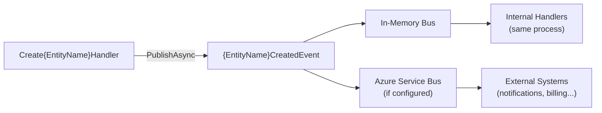

# {FeatureName} — Domain Events

## Events Published

### {EntityName}CreatedEvent

Raised immediately after a new {entityName} is successfully created and persisted.

**Published by**: `Create{EntityName}CommandHandler`

**Payload**

```csharp
public sealed record {EntityName}CreatedEvent(Guid Id, string {KeyField});
```

| Property | Type | Description |
|----------|------|-------------|
| `Id` | `Guid` | The newly created {entityName}'s ID |
| `{KeyField}` | `string` | {Key identifying property, e.g., Name or Email} |

**Current Subscribers**

| Handler Class | Bus Type | Action |
|--------------|----------|--------|
| `{EntityName}CreatedFromMemoryHandler` | In-Memory | Internal audit / testing |
| _{Add external handlers as they are added}_ | Azure Service Bus | External notifications |

**Code Example** — How to subscribe:

```csharp
internal sealed class SendWelcomeNotificationHandler :
    Fluents.EventsConsumers.IHandler<{EntityName}CreatedEvent>
{
    public Task OnHandle(
        {EntityName}CreatedEvent notification,
        CancellationToken cancellationToken)
    {
        // TODO: implement side-effect logic
        return Task.CompletedTask;
    }
}
```

---

### {EntityName}StatusChangedEvent

> Add this section if status changes (approve/reject) publish events.

Raised when a {entityName}'s status changes (e.g., Approved or Rejected).

**Published by**: `Approve{EntityName}CommandHandler`, `Reject{EntityName}CommandHandler`

**Payload**

```csharp
public sealed record {EntityName}StatusChangedEvent(
    Guid Id,
    string OldStatus,
    string NewStatus,
    string? Reason);
```

| Property | Type | Description |
|----------|------|-------------|
| `Id` | `Guid` | The {entityName}'s ID |
| `OldStatus` | `string` | Status before change |
| `NewStatus` | `string` | Status after change |
| `Reason` | `string?` | Reason provided (e.g., rejection reason) |

**Current Subscribers**

| Handler Class | Bus Type | Action |
|--------------|----------|--------|
| _{None yet — add as needed}_ | — | — |

---

### {EntityName}DeletedEvent

> Add this section only if deletion publishes an event.

Raised when a {entityName} is soft-deleted.

**Published by**: `Delete{EntityName}CommandHandler`

**Payload**

```csharp
public sealed record {EntityName}DeletedEvent(Guid Id, string DeletedBy);
```

---

## Events Consumed

> List any events from OTHER features that this feature subscribes to.
> If none, keep the statement below.

This feature does not currently consume events from other features.

---

## Event Bus Configuration

Events are dispatched via the SlimBus message bus with two bus types:

| Bus Type | When Active | Purpose |
|----------|-------------|---------|
| **In-Memory** | Always (all environments) | Same-process handlers; local side effects |
| **Azure Service Bus** | When `ConnectionStrings:AzureBus` is non-empty | Cross-service/process messaging |

See `SlimBus.Infra/Extensions/ServiceBusSetup.cs` for wiring configuration.



---

## Adding a New Event Subscriber

To subscribe to an event from this feature:

1. Create a handler class in the consuming feature's AppServices project
2. Implement `Fluents.EventsConsumers.IHandler<TEvent>`
3. The message bus auto-discovers handlers via assembly scan — no manual registration needed

```csharp
// In the consuming feature's AppServices project:
internal sealed class On{EntityName}CreatedHandler :
    Fluents.EventsConsumers.IHandler<{EntityName}CreatedEvent>
{
    public Task OnHandle(
        {EntityName}CreatedEvent notification,
        CancellationToken cancellationToken)
    {
        // React to the event
        return Task.CompletedTask;
    }
}
```
