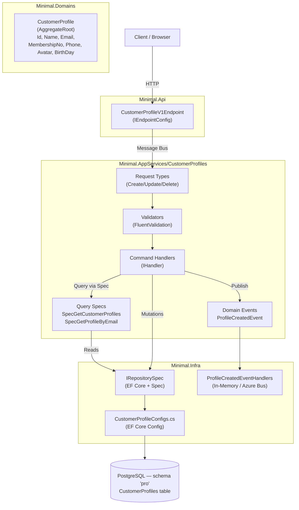
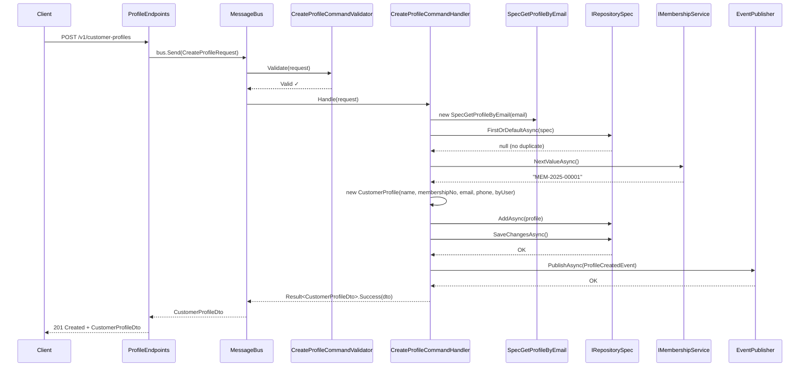
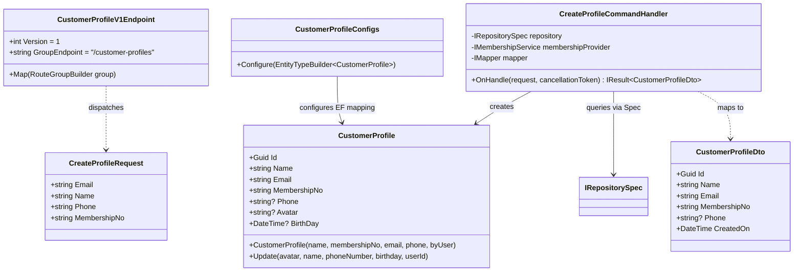
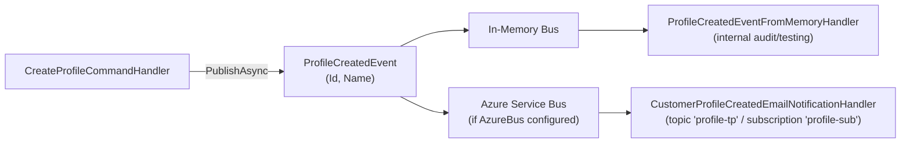

# Customer Profiles — Architecture

## Vertical Slice Overview

Customer Profiles follows the DKNet vertical slice architecture.
Each layer has a single, focused responsibility for this feature.

## Create Profile — Sequence Diagram

## Component Diagram

## Event Flow

## Layer Responsibilities

| Layer | Responsibility in Customer Profiles |
|-------|--------------------------------------|
| `Minimal.Api` | Route mapping only; no business logic — dispatches to message bus |
| `Minimal.AppServices` | Command handling, FluentValidation, membership number generation, event publishing |
| `Minimal.Domains` | `CustomerProfile` entity with constructors and `Update()` method |
| `Minimal.Infra` | EF Core `CustomerProfileConfigs`, `IRepositorySpec` implementation, event handler wiring |

> There is no approval workflow or soft-delete on `CustomerProfile` — it has no `Status` or
> `IsDeleted` field. `DELETE` removes the row. If your feature needs a workflow like this, add the
> field/state machine yourself; don't assume one exists here.
