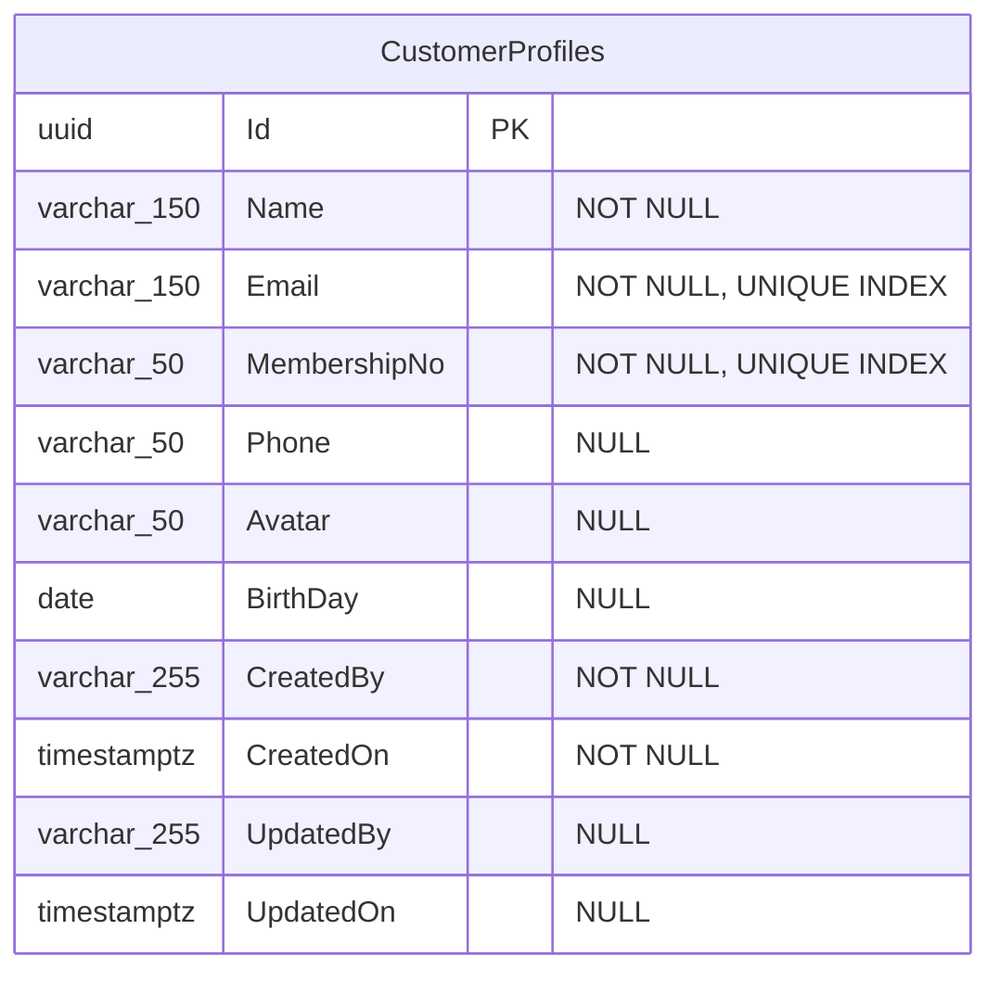

# Customer Profiles — Data Model

## Entity Relationship Diagram



Table `CustomerProfiles`, schema `pro` (`DomainSchemas.Profile`) — PostgreSQL via Npgsql, not SQL
Server. `Id`, `CreatedBy`/`CreatedOn`, `UpdatedBy`/`UpdatedOn` come from the shared
`AuditedEntity<Guid>` base (`AggregateRoot` → `DomainEntity`), not from anything declared on
`CustomerProfile` itself.

## Properties

| C# Property | C# Type | DB Column | DB Type | Nullable | Constraints |
|-------------|---------|-----------|---------|----------|-------------|
| `Id` | `Guid` | `Id` | `uuid` | No | PK |
| `Name` | `string` | `Name` | `character varying(150)` | No | |
| `Email` | `string` | `Email` | `character varying(150)` | No | Unique index `IX_CustomerProfiles_Email` |
| `MembershipNo` | `string` | `MembershipNo` | `character varying(50)` | No | Unique index `IX_CustomerProfiles_MembershipNo` |
| `Phone` | `string?` | `Phone` | `character varying(50)` | Yes | |
| `Avatar` | `string?` | `Avatar` | `character varying(50)` | Yes | Avatar URL/path |
| `BirthDay` | `DateTime?` | `BirthDay` | `date` | Yes | |
| `CreatedBy` | `string` | `CreatedBy` | `character varying(255)` | No | Set from authenticated user ID |
| `CreatedOn` | `DateTimeOffset` | `CreatedOn` | `timestamp with time zone` | No | |
| `UpdatedBy` | `string?` | `UpdatedBy` | `character varying(255)` | Yes | Set on each mutation |
| `UpdatedOn` | `DateTimeOffset?` | `UpdatedOn` | `timestamp with time zone` | Yes | |

There is no `Status` and no `IsDeleted` column — this entity has no approval workflow and no
soft-delete.

## EF Core Mapping Configuration

Configured in `Minimal.Infra/Features/Profiles/Mappers/CustomerProfileConfigs.cs` via
`DefaultEntityTypeConfiguration<CustomerProfile>` (`IEntityTypeConfiguration<CustomerProfile>`
under the hood).

| Configuration | Detail |
|---------------|--------|
| Table name | `CustomerProfiles`, schema `pro` |
| PK | `Id` (`Guid`/`uuid`) |
| Unique index on `Email` | `HasIndex(x => x.Email).IsUnique()` |
| Unique index on `MembershipNo` | `HasIndex(x => x.MembershipNo).IsUnique()` |
| Max lengths | Enforced via `HasMaxLength()` per property — required by `Minimal.App.Tests/Architecture/InfraTests.cs`, not just style |

## Validation Rules

`CreateProfileCommandValidator` (FluentValidation) is the only validator for this entity —
`UpdateProfileRequest` currently has **no** FluentValidation validator at all.

| Property | Validation Rule | Enforced by |
|----------|----------------|-------------|
| `Email` | Required; valid email format; length 1–1000 | `CreateProfileCommandValidator` + DB unique index |
| `Phone` | Required; length 6–50 | `CreateProfileCommandValidator` only |
| `Name` | Required; length 6–100 | `CreateProfileCommandValidator` only |

`UpdateProfileRequest` accepts `Email`/`Name`/`Phone` as nullable — a `null` value leaves the
current stored value unchanged (see `CustomerProfile.Update`) — but nothing validates format or
length on that path today.

## Domain Entity Methods

The `CustomerProfile` entity encapsulates its mutations:

```csharp
// Constructor — enforces required fields
public CustomerProfile(
    string name,
    string membershipNo,
    string email,
    string phone,
    string byUser)

// Update — mutates allowed fields; null/empty name or phoneNumber leaves the current value unchanged
public void Update(
    string? avatar,
    string? name,
    string? phoneNumber,
    DateTime? birthday,
    string userId)
```

> **Rule**: all mutations go through entity methods. Direct property setters (e.g.,
> `profile.Email = "..."`) are not possible from outside the entity boundary — every property
> setter is `private`.

## Membership number generation

`MembershipNo` is assigned by `IMembershipService.NextValueAsync()`
(`Minimal.Infra/Services/MembershipService.cs`), which pulls the next value from the PostgreSQL
sequence `Seq_Membership` (schema `seq`) via `SequenceService`. Non-Postgres providers (e.g. the
EF Core in-memory database used by tests) fall back to a `Guid.NewGuid().ToString()`; the test
suite instead swaps in `TestMembershipService`, which returns deterministic `TEST-MEM-{n:D6}`
values.

## Migration History

| Migration | Description |
|-----------|--------------|
| `InitDb` | Creates the `pro`/`seq` schemas, the `Seq_Membership` sequence, and the `CustomerProfiles` table with its two unique indexes |
| `AddLoyaltyMemberships` | Adds the `LoyaltyMemberships` table/schema; does not alter `CustomerProfiles` |

To create a new migration after a schema change, from `src/ApiEndpoints/`:

```bash
./add-migration.sh <MigrationName>
```
