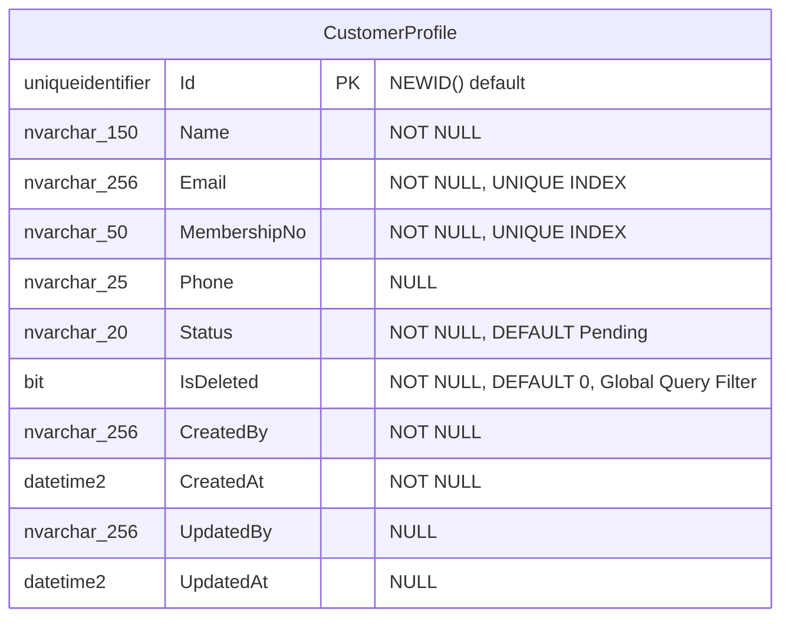

# Customer Profiles — Data Model

## Entity Relationship Diagram



## Properties

| C# Property | C# Type | DB Column | DB Type | Nullable | Constraints |
|-------------|---------|-----------|---------|----------|-------------|
| `Id` | `Guid` | `Id` | `uniqueidentifier` | No | PK, `NEWID()` default |
| `Name` | `string` | `Name` | `nvarchar(150)` | No | |
| `Email` | `string` | `Email` | `nvarchar(256)` | No | Unique index `IX_CustomerProfile_Email` |
| `MembershipNo` | `string` | `MembershipNo` | `nvarchar(50)` | No | Unique index `IX_CustomerProfile_MembershipNo` |
| `Phone` | `string?` | `Phone` | `nvarchar(25)` | Yes | |
| `Status` | `string` | `Status` | `nvarchar(20)` | No | Default `Pending` |
| `IsDeleted` | `bool` | `IsDeleted` | `bit` | No | Default `0`; EF Global Query Filter `IsDeleted == false` |
| `CreatedBy` | `string` | `CreatedBy` | `nvarchar(256)` | No | Set from authenticated user ID |
| `CreatedAt` | `DateTime` | `CreatedAt` | `datetime2` | No | UTC |
| `UpdatedBy` | `string?` | `UpdatedBy` | `nvarchar(256)` | Yes | Updated on each mutation |
| `UpdatedAt` | `DateTime?` | `UpdatedAt` | `datetime2` | Yes | UTC |

## EF Core Mapping Configuration

Configured in `Minimal.Infra/Features/Profiles/Mappers/ProfileMapper.cs` via `IEntityTypeConfiguration<CustomerProfile>`.

| Configuration | Detail |
|---------------|--------|
| Table name | `CustomerProfiles` (default schema) |
| PK | `Id` (GUID) |
| Unique index on `Email` | `HasIndex(x => x.Email).IsUnique()` |
| Unique index on `MembershipNo` | `HasIndex(x => x.MembershipNo).IsUnique()` |
| Global Query Filter | `.HasQueryFilter(x => !x.IsDeleted)` — automatically excludes soft-deleted records |
| Max lengths | Enforced via `HasMaxLength()` per property |

## Validation Rules

Validated by `CreateProfileCommandValidator` and `UpdateProfileCommandValidator` (FluentValidation).

| Property | Validation Rule | Enforcement |
|----------|----------------|-------------|
| `Name` | Required; max 150 chars | FluentValidation + DB constraint |
| `Email` | Required; valid email format; max 256 chars; unique across all profiles | FluentValidation + DB unique index |
| `Phone` | Optional; max 25 chars | FluentValidation + DB constraint |
| `Reason` (approve/reject) | Required for reject; max 500 chars | FluentValidation |

## Status Values

| Status | Value | Description | Transitions |
|--------|-------|-------------|-------------|
| `Pending` | `"Pending"` | Default state on creation | → `Approved`, → `Rejected` |
| `Approved` | `"Approved"` | KYC verified; customer is active | terminal (until deleted) |
| `Rejected` | `"Rejected"` | KYC failed; rejection reason recorded | terminal (until deleted) |

## Domain Entity Methods

The `CustomerProfile` entity encapsulates its mutations:

```csharp
// Constructor — enforces required fields and sets initial status
public CustomerProfile(
    string name,
    string membershipNo,
    string email,
    string? phone,
    string byUser)

// Update — mutates allowed fields
public void Update(
    string email,
    string name,
    string? phone,
    string status,
    string byUser)
```

> **Rule**: All mutations go through entity methods. Direct property setters (e.g., `profile.Email = "..."`)
> are not permitted from outside the entity boundary.

## Migration History

| Migration | Description |
|-----------|-------------|
| `InitCustomerProfile` | Initial table creation with all columns, PK, and unique indexes |

To create a new migration after schema changes:

```bash
# From src/Minimal.ApiEndpoints/
./add-migration.sh <MigrationName>
```
