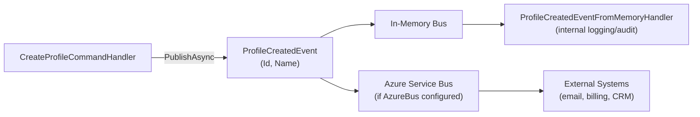

# Customer Profiles — Domain Events

## Events Published

### ProfileCreatedEvent

Raised immediately after a new customer profile is successfully created and persisted.

**Published by**: `CreateProfileCommandHandler`

**Payload**

```csharp
public sealed record ProfileCreatedEvent(Guid Id, string Name);
```

| Property | Type | Description |
|----------|------|-------------|
| `Id` | `Guid` | The newly created profile's ID |
| `Name` | `string` | The customer's full name |

**Current Subscribers**

| Handler Class | Bus Type | Action |
|--------------|----------|--------|
| `ProfileCreatedEventFromMemoryHandler` | In-Memory | Internal log / test hook |
| _(None configured)_ | Azure Service Bus | — (reserved for external notifications) |

Source: `Minimal.AppServices/CustomerProfiles/V1/Events/`
and `Minimal.Infra/Features/Profiles/` (if infra handlers present)

**Subscriber Example**

```csharp
// In AppServices or Infra — auto-discovered by SlimBus assembly scan
internal sealed class ProfileCreatedEventFromMemoryHandler :
    Fluents.EventsConsumers.IHandler<ProfileCreatedEvent>
{
    private readonly ILogger<ProfileCreatedEventFromMemoryHandler> _logger;

    public ProfileCreatedEventFromMemoryHandler(
        ILogger<ProfileCreatedEventFromMemoryHandler> logger)
    {
        _logger = logger;
    }

    public Task OnHandle(
        ProfileCreatedEvent notification,
        CancellationToken cancellationToken)
    {
        _logger.LogInformation(
            "Customer profile created: {Id} - {Name}",
            notification.Id,
            notification.Name);

        return Task.CompletedTask;
    }
}
```

---

## Events Consumed

This feature does not currently consume events from other features.

---

## Event Bus Configuration

| Bus Type | When Active | Purpose |
|----------|-------------|---------|
| **In-Memory** | Always (all environments) | Same-process handlers — logging, internal side effects |
| **Azure Service Bus** | When `ConnectionStrings:AzureBus` is non-empty in config | Cross-service messaging, notifications, billing hooks |

The wiring is in `Minimal.Infra/Extensions/ServiceBusSetup.cs`:

```csharp
// Excerpt from ServiceBusSetup.cs
services.AddServiceBus(bus =>
{
    bus.AddConsumersFromAssembly(typeof(AppSetup).Assembly);   // AppServices handlers
    bus.AddConsumersFromAssembly(typeof(InfraSetup).Assembly); // Infra handlers

    if (!string.IsNullOrEmpty(configuration.GetConnectionString("AzureBus")))
    {
        bus.AddAzureServiceBus(/* ... */);
    }
});
```

## Event Flow Diagram



## Adding a New Subscriber

To react to `ProfileCreatedEvent` from another feature or service:

1. Create a handler class in your feature's AppServices project
2. Implement `Fluents.EventsConsumers.IHandler<ProfileCreatedEvent>`
3. No manual DI registration — SlimBus scans assemblies automatically

```csharp
internal sealed class SendWelcomeEmailOnProfileCreatedHandler :
    Fluents.EventsConsumers.IHandler<ProfileCreatedEvent>
{
    private readonly IEmailService _email;

    public SendWelcomeEmailOnProfileCreatedHandler(IEmailService email) => _email = email;

    public Task OnHandle(
        ProfileCreatedEvent notification,
        CancellationToken cancellationToken)
        => _email.SendWelcomeAsync(notification.Id, cancellationToken);
}
```
