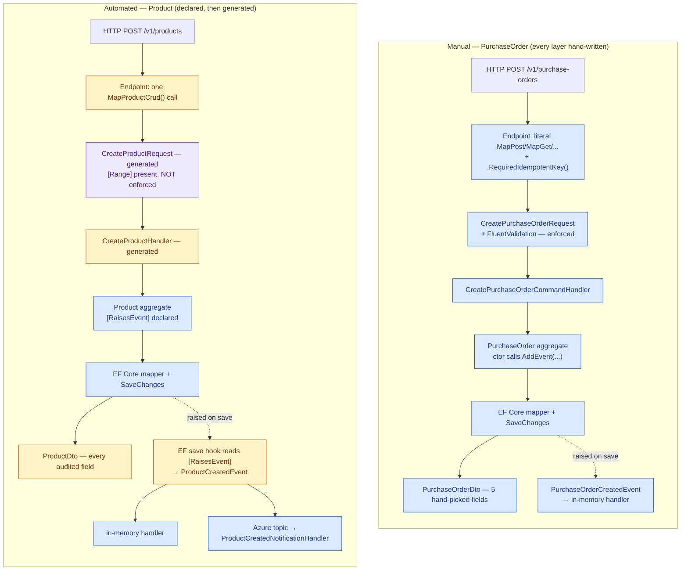

# Manual vs. automated: what each sample writes, and what the developer gives up

Two samples live side by side under `src/ApiEndpoints/`, implementing the same shape of feature —
entity, event, event handler, CRUD, queries, endpoint — by two different means:

- **`PurchaseOrder`** (`ManualSample/`) — every layer is hand-written. No declarative
  event/CRUD/DTO-generation attribute is used anywhere in it.
- **`Product`** (`AutomatedSample/`) — every layer the DKNet 10.1.12 generators can produce is
  declared, not written: `[RaisesEvent]` for events, `[CrudCreate]`/`[CrudUpdate]` +
  `[GenerateDto]` for the request/handler/route/DTO shapes.

This document is the layer-by-layer account of that difference, and — where the automated sample
produces a layer instead of writing it — what control or visibility the developer gives up in
exchange. Every claim below is checked against the code on this branch; generated type names are
taken from the compiled output (`Minimal.AppServices/obj/Generated/...` and, for the two event
record types the `Minimal.Domains` project doesn't emit to disk, from a `strings` scan of
`Minimal.Domains.dll` confirming both `ProductCreatedEvent` and `ProductPriceUpdatedEvent` exist as
real compiled types).

## The two flows, side by side

Both samples run the same request through the same vertical slice. The difference is *who authors
each stage* — you, or a generator/generic library route. Blue = hand-written; amber = generated at
compile time; purple = a generic library route that no per-entity code backs.

Read the two lanes stage-for-stage: the amber and purple nodes in the automated lane are exactly the
layers you no longer write — and exactly where the trade-offs below live. The blue nodes in *both*
lanes are the layers neither generator touches.

## Layers both samples hand-write regardless

No generator in this template produces these; the automated sample writes them by hand just like the
manual one, so they carry no trade-off:

- **Domain entity** — `Product.cs` (~45 lines) is as hand-written as `PurchaseOrder.cs` (~55 lines).
  The generators attach to a real entity; there is no "generate the entity" mode.
- **EF Core mapping** — `ProductConfigs.cs` (unique index on `Name`, length 150, `Price` precision
  `(18,2)`, table `sample.Products`) is hand-written, same as `PurchaseOrderConfigs.cs`. None of the
  three generators touch `IEntityTypeConfiguration`.
- **Internal event handler** — `ProductCreatedEventHandler` is hand-written. `[RaisesEvent]` only
  *declares and raises*; it never generates a consumer.
- **Schema migration** — one shared EF Core baseline against `CoreDbContext` covers
  `manual_sample.PurchaseOrders` and `sample.Products` together.
- **Tests** — `Unit/AutomatedSample/*` and `Integration/AutomatedSample/*` mirror the manual
  layout; `Architecture/SampleInvariantTests.cs` covers both samples' layer-boundary and naming
  rules together.

## What the automated sample produces instead of writing

Each of these is a layer `Product` *declares* (via an attribute) and the DKNet 10.1.12 generators
emit at compile time — the amber/purple nodes in the diagram:

- **Event definition** — `[RaisesEvent(EventOperations.Created, Include = [...])]` and
  `[RaisesEvent(EventOperations.Updated, nameof(Price))]` compose `ProductCreatedEvent`
  (`Id`, `Name`, `Price`) and `ProductPriceUpdatedEvent`. Neither has a source file; both are
  compiler output only.
- **Event raising** — nothing in `AutomatedSample/` calls `AddEvent`. DKNet's EF Core save hook
  reads the `[RaisesEvent]` rules and raises after a successful `SaveChanges`, driven by
  change-tracker state.
- **Create/Update requests + handlers** — `[CrudCreate]` on the constructor and `[CrudUpdate]` on
  `ChangePrice(decimal)` generate `CreateProductRequest`/`CreateProductHandler` and
  `ChangePriceProductRequest`/`ChangePriceProductHandler` (both 404 via `NotFoundError`, same failure
  shape as the manual handlers).
- **Get-by-id / list / delete routes** — no per-entity code at all; `MapProductCrud()` wires the
  *generic* `MapGetById`/`MapGetList`/`MapDeleteById<Product, Guid, ...>` extensions from
  `DKNet.AspCore.Extensions`.
- **DTO** — `[GenerateDto(typeof(Product))] public sealed partial record ProductDto;` (one line)
  generates every audited property: `Name`, `Price`, `IsDiscontinued`, `CreatedBy`, `CreatedOn`,
  `LastModifiedBy`, `LastModifiedOn`, `UpdatedBy`, `UpdatedOn`, `Id`.
- **Endpoint registration** — `ProductV1Endpoint.cs` is 9 lines (one `MapProductCrud()` +
  `.WithDescription`) versus ~90 lines of literal `Map*` calls in `PurchaseOrderV1Endpoint.cs`.

## What you give up in exchange

The trade-offs, sharpest first. Every one corresponds to an amber/purple node above.

### Request validation that looks wired but never runs — the sharpest gap

`CreateProductRequest.Price` genuinely carries `[Range(0.01, double.MaxValue)]` (attribute forwarding
works exactly as documented — inspect `ProductCrudRequests.g.cs`). **Nothing evaluates it.** .NET 10's
automatic minimal-API validation for complex-type parameters only activates through the
`Microsoft.Extensions.Validation.ValidationsGenerator` source generator, itself gated on
`<EnableRequestDelegateGenerator>true</EnableRequestDelegateGenerator>` (not set here). Even with
that flag forced on, the generator only recognizes **literal** `Map*(string, Delegate)` calls in the
compiling project's own source — which is exactly what `PurchaseOrderV1Endpoint` writes, so its
FluentValidation rules run. The automated sample maps through `DKNet.AspCore.Extensions`'s generic
`MapPost<TRequest,TResponse>`, compiled inside a precompiled package the source generator cannot see
through. **Empirically: `POST /v1/products` with `price: -1` returns `201`, not `400`.**

Fixing it means either hand-writing a validator for a generator-owned request (defeating the point)
or changing `DKNet.AspCore.Extensions` itself (a different repo) — both out of scope. Pick the
automated path only where the DataAnnotations rules you can express are genuinely optional, or accept
you must drop to a hand-mapped route the moment validation matters.

### No idempotency on POST

The manual create route calls `.RequiredIdempotentKey()` — a replayed `X-Idempotency-Key` returns
the original response instead of a duplicate (confirmed live: same key twice → same id/body). The
generated `MapPost<CreateProductRequest, ProductDto>` adds no such filter, and nothing in
`ProductV1Endpoint` adds one by hand. A duplicate-submit or client-retry on `POST /v1/products`
**silently creates two products**; adding protection means dropping the generated create route.

### The DTO exposes every audited field by default

`ProductDto` ships `CreatedOn`/`LastModifiedOn`/`UpdatedOn`/`UpdatedBy` to every caller because the
default is "everything audited", not "only what I chose". Narrowing requires an explicit
`Exclude`/`Include` on `[GenerateDto]`. The manual `PurchaseOrderDto` exposes exactly 5 fields
because nobody wrote the others into it.

### No filtered list, no custom get-by-id, no pre-delete business rule

The generic routes are all-or-nothing:

- **List** pages over every row with no filter, sort, or page-size ceiling — adding a `?name=`
  filter means abandoning the generated list route for a hand-written query (the manual
  `ListPurchaseOrdersQuery` has a `CustomerName` filter).
- **Get-by-id** has no query object to extend — a future "also check tenant ownership" or "expand a
  related entity" forces that one route back to hand-written.
- **Delete** either deletes or 404s; there is nowhere to hang a "can this row be deleted" check. The
  manual sample's `Cancel` demonstrates exactly this — rejecting an already-cancelled order with a
  domain-specific 400.

### Event naming is out of your hands, and requests can't carry extra fields

The `[RaisesEvent]` convention composes `<Entity><Label?><NarrowingProps><Operation>Event` — hence
`ProductPriceUpdatedEvent`, **not** `ProductUpdatedEvent`. Two updates on different properties need
distinct label segments to avoid a collision, not hand-chosen names. Adding a field the generator
didn't `Include`/infer means switching to the type-naming form (`[RaisesEvent(typeof(SomeDto), ...)]`
against a `[GenerateDto]` record you own).

Likewise, a generated request is a mechanical 1:1 of the source signature: `CreateProductRequest`
mirrors the constructor's parameters, and `ChangePriceProductRequest` can only ever change price.
You cannot add a request-only field (captcha token, client correlation id) without adding it to the
constructor, and a method needing to change two unrelated fields together needs two `[CrudUpdate]`
methods (two routes) or a hand-written one.

### Acting-user attribution: you lose visibility, not safety

The generator forwards only `System.ComponentModel.DataAnnotations` attributes, so `[FromClaim]`
(namespace `DKNet.AspCore.Extensions.ModelBinding`) can never reach a generated property — the
`[CrudCreate]` constructor takes no acting-user parameter. Instead
`DKNet.EfCore.DataAuthorization`'s `DataOwnerHook` stamps `CreatedBy`/`CreatedOn` on insert and
`UpdatedBy`/`UpdatedOn` on modify from `IDataOwnerProvider`, wired once at the composition root
(`ServiceConfigs.cs`). A payload claiming `"createdBy": "someone-else"` has no property to land on —
so the forgery guarantee is *identical* to the manual sample's `[FromClaim]` population. What you
lose is being able to see *where* it happens by reading `AutomatedSample/`; it lives in a shared save
hook. (As of DKNet `10.1.12`, `DataOwnerHook` stamps on modify as well as insert — verified live
over `Product`'s `PUT` route.)

### The external-broker path is real but untested here

`ServiceBusSetup.cs` wires `azb.Produce<ProductCreatedEvent>(...)` /
`azb.Consume<ProductCreatedEvent>(...)` and `ProductCreatedNotificationHandler` is the hand-written
external subscriber — proving a *declaratively raised* event still reaches an external topic exactly
like a hand-raised one. But that handler registers only on the `AzureBus` child bus (wired only when
`ConnectionStrings:AzureBus` is non-empty), which neither the xUnit nor BDD host ever sets. The
in-memory bus the tests run against is a separate bus. `ProductCreatedNotificationHandlerTests`
covers the handler's own behaviour directly, but Produce → topic → Consume against a real/emulated
broker remains an untested path. (The manual sample carries no external-broker wiring at all — a
deliberate scope split, not a generator limitation. Static seeding is the mirror split: the manual
sample seeds 3 `PurchaseOrder` rows via `UseAutoDataSeeding`; no `Product` seed file was written,
though nothing about the generators would prevent one.)

### Two real bugs the manual sample's hand-written code surfaced (and fixed)

Writing every layer by hand means bugs surface in code you wrote, where you can fix them directly —
both are called out here because the comparison above assumes they're already fixed:

1. `SpecGetPurchaseOrder` with no filter compiled to `WHERE FALSE` — the underlying predicate
   builder needs at least one `.And()`/`.Or()` call to "start". Fixed by forcing a `true` predicate
   when neither `byId` nor `byCustomerName` is supplied (`Minimal.AppServices/ManualSample/V1/Specs/SpecGetPurchaseOrder.cs`).
2. `UpdatePurchaseOrderRequest.Id` was validated as "must not be empty" against the raw request
   body, but the route supplies `Id` from the URL, not the JSON body, and auto-validation ran
   before the route value was patched in. Fixed by dropping the redundant rule — an unknown/empty
   id now correctly 404s from the repository lookup instead of 400ing from the validator.

Neither class of bug is possible in the automated sample's create/update path, because there is no
hand-written spec or validator for the generator to get wrong — that absence is itself part of what
"produced" buys you, symmetric with the validation gap above costing you elsewhere.

## When to pick which

Pick the **manual** shape (`PurchaseOrder`) when a feature needs any of: idempotent writes,
enforced request validation beyond what a DataAnnotations attribute can express, a business rule
that blocks an operation conditionally (an already-cancelled order, a locked record), a filtered
list query, or a response DTO that deliberately hides fields. Every one of those is a "give up"
section above for the generated path today.

Pick the **automated** shape (`Product`) for a genuinely plain CRUD entity — one whose validation
rules are fully expressible as DataAnnotations *and* where you either don't route through a generic
library wrapper (so the .NET 10 validation generator can still see the route) or don't need that
validation enforced at all, and where "delete every field on the entity in the DTO by default" is
acceptable. It buys real speed (an entity, one DTO line, two attributes vs. ~14 hand-written files)
and a stronger acting-user guarantee, at the cost of every "give up" section above — most sharply,
request validation that looks wired but silently never runs under this template's own
endpoint-registration convention.
