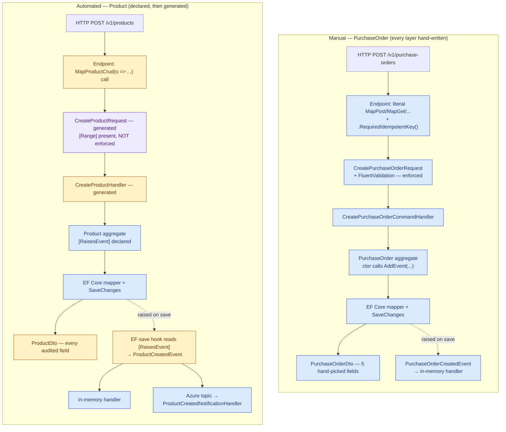

# Manual vs. Automated: A Layer-by-Layer Comparison

The template ships two complete samples under `src/ApiEndpoints/`. Both implement the same shape of
feature — entity, event, event handler, CRUD, queries, endpoint — but by different means:

| Sample | Location | Approach |
|--------|----------|----------|
| **PurchaseOrder** | `ManualSample/` | Every layer is hand-written. No declarative event/CRUD/DTO-generation attribute is used anywhere. |
| **Product** | `AutomatedSample/` | Every layer the DKNet 10.1.14 generators can produce is declared, not written: `[RaisesEvent]` for events, `[CrudCreate]`/`[CrudUpdate]`/`[CrudAction]` + `[GenerateDto]` for the request/handler/route/DTO shapes. |

This document walks through that difference layer by layer and, wherever the automated sample
*produces* a layer instead of writing it, explains what control or visibility you give up in
exchange.

> **How these claims were verified.** Every statement below is checked against the code on this
> branch. Generated type names come from the compiled output
> (`Minimal.AppServices/obj/Generated/...`). The two event record types that `Minimal.Domains`
> doesn't emit to disk were confirmed by a `strings` scan of `Minimal.Domains.dll`, which shows both
> `ProductCreatedEvent` and `ProductPriceUpdatedEvent` as real compiled types.

## At a glance: which one should I copy?

This section is the single statement of which sample to copy. Every other page links here rather than
paraphrasing it — the per-sample READMEs, [`docs/ddd-implementation-guide.md`](../ddd-implementation-guide.md)
and [`docs/extension-points.md`](../extension-points.md) all do.

**Copy the manual sample (`PurchaseOrder`)** when the feature needs any of the following. Each one
maps to a trade-off explained later in this document:

- Idempotent writes (safe client retries)
- Attribute-declared (`DataAnnotations`) validation that is actually enforced
- An operation that writes more than one aggregate in one transaction
- A filtered or customized list query

**A response shape you control is no longer a reason either.** Hiding a field on a generated DTO is
`[GenerateDto(..., Exclude = [...])]`, and a value the convention cannot produce can be *added* to a
generated response by hand — one property on the `partial record` plus a Mapster `IRegister`, with no
route, request or handler leaving the generated set. The worked case is `ProductDto.GrossMargin`: see
[the automated sample](automated-products/README.md#a-response-value-the-convention-cannot-produce)
and §3 below for what it costs on the list route's query surface.

A rule that conditionally refuses an operation is **not** on that list. A FluentValidation validator
written against a *generated* request runs on the generated route — the group-level
`AddFluentValidationAutoValidation()` filter (`Minimal.Api/Program.cs:50`) applies to every route in
the group, generated or hand-mapped — so the rule can read stored data and refuse before the handler
runs. The automated sample does exactly that twice: `POST /v1/products` refuses a name already taken,
and `DELETE /v1/products/{id}` refuses a product that is still for sale. Both answer `409`, and
neither has a hand-written route, request or handler. See §4 below.

**Copy the automated sample (`Product`)** for a genuinely plain CRUD entity — one where
DataAnnotations can express every validation rule you care about (or you don't need them enforced),
and where exposing every audited field in the DTO is acceptable. In exchange you write an entity,
one DTO line, and a handful of attributes instead of roughly 14 hand-written files, and you get a
stronger acting-user guarantee.

That generated shape is not limited to plain create/update/list/delete: **named domain actions come
with it.** `[CrudAction]` publishes a business operation — approve, assign a supplier reference — at
the entity's by-id route plus a segment, with the verb and segment under your control, and no
hand-written request, handler or route registration. The trade-off is the one in the first list
above: an attribute-declared rule on a generated action's request is still never evaluated. Needing to
*refuse* an action is not a trade-off any more — write the rule as a FluentValidation validator against
the generated request, the way this sample's create and delete rules are written.

**The choice is not either/or, and the automated sample no longer pretends it is.** `CrudMapOptions`
lets one endpoint drop a single generated route by name and hand-write that one route below the
generated call, so the generator keeps the routes it expresses well and you write only the ones it
cannot. `ProductV1Endpoint` is exactly that composite: `MapProductCrud(o => …)` first, carrying the
per-route scopes and `Exclude("Discontinue")`, then two hand-written routes — a discontinue that
writes two aggregates in one transaction, and a summary query the generator has no shape for.

The rest of this document is the evidence behind that guidance.

## How each request flows

Both samples run the same request through the same vertical slice. The difference is *who authors
each stage* — you, a compile-time generator, or a generic library route with no per-entity code
behind it.

**Legend:** blue = hand-written · amber = generated at compile time · purple = generic library
route, no per-entity code.



Read the two lanes stage for stage. The amber and purple nodes in the automated lane are exactly
the layers you no longer write — and exactly where the trade-offs below live. The blue nodes in
*both* lanes are the layers no generator touches.

<script type="module">
  // GitHub Pages' default Jekyll doesn't render ```mermaid fences; load mermaid ourselves.
  import mermaid from 'https://cdn.jsdelivr.net/npm/mermaid@11/dist/mermaid.esm.min.mjs';
  document.querySelectorAll('code.language-mermaid').forEach(code => {
    const pre = document.createElement('pre');
    pre.className = 'mermaid';
    pre.textContent = code.textContent;
    code.closest('pre').replaceWith(pre);
  });
  await mermaid.run();
</script>

## Layers both samples hand-write

No generator in this template produces these layers. The automated sample writes them by hand just
like the manual one, so they carry no trade-off:

- **Domain entity.** `Product.cs` (~45 lines) is as hand-written as `PurchaseOrder.cs` (~55 lines).
  The generators attach to a real entity; there is no "generate the entity" mode.
- **EF Core mapping.** `ProductConfigs.cs` (unique index on `Name`, length 150, `Price` precision
  `(18,2)`, table `sample.Products`) is hand-written, same as `PurchaseOrderConfigs.cs`. None of
  the three generators touch `IEntityTypeConfiguration`.
- **Internal event handler.** `ProductCreatedEventHandler` is hand-written. `[RaisesEvent]` only
  *declares and raises* an event; it never generates a consumer.
- **Schema migration.** One shared EF Core baseline against `CoreDbContext` covers
  `manual_sample.PurchaseOrders` and `sample.Products` together.
- **Tests.** `Unit/AutomatedSample/*` and `Integration/AutomatedSample/*` mirror the manual layout;
  `Architecture/SampleInvariantTests.cs` covers both samples' layer-boundary and naming rules
  together.

## Layers the automated sample generates

Each of these is a layer `Product` *declares* (via an attribute) and the DKNet 10.1.14 generators
emit at compile time — the amber and purple nodes in the diagram:

- **Event definitions.** `[RaisesEvent(EventOperations.Created, Include = [...])]` and
  `[RaisesEvent(EventOperations.Updated, nameof(Price))]` compose `ProductCreatedEvent`
  (`Id`, `Name`, `Price`) and `ProductPriceUpdatedEvent`. Neither has a source file; both exist
  only as compiler output.
- **Event raising.** Nothing in `AutomatedSample/` calls `AddEvent`. DKNet's EF Core save hook
  reads the `[RaisesEvent]` rules and raises the event after a successful `SaveChanges`, driven by
  change-tracker state.
- **Create/Update requests and handlers.** `[CrudCreate]` on the constructor and `[CrudUpdate]` on
  `ChangePrice(decimal)` generate `CreateProductRequest`/`CreateProductHandler` and
  `ChangePriceProductRequest`/`ChangePriceProductHandler`. Both return 404 via `NotFoundError` —
  the same failure shape as the manual handlers.
- **Domain-action requests, handlers and routes.** `[CrudAction]` on a method publishes a named
  business operation at the entity's by-id route plus one segment, generating its request, handler
  and route the same way. `Product` publishes two: `[CrudAction("approval")] Approve(string byUser)`
  → `POST /v1/products/{id}/approval`, and
  `[CrudAction("supplier-reference", Verb = CrudActionVerb.Put)] AssignSupplierReference(string)`
  → `PUT /v1/products/{id}/supplier-reference`. Both answer `200` with `ProductDto`. Its third
  action, `Discontinue`, is excluded from the generated map by name and hand-written below it,
  because discontinuing a product also creates its named replacement in the same transaction, and an
  operation that writes more than one aggregate in one transaction cannot be generated. The manual sample's equivalent — `Cancel.cs` plus its
  literal `MapPost(".../cancel")` — is hand-written in full. See
  [`docs/crud-attributes.md`](../crud-attributes.md#domain-actions-with-crudaction) for declaring
  one, and trade-off 4 below for what a generated action cannot do that `Cancel` does.
- **Get-by-id / list / delete routes.** No per-entity code at all. `MapProductCrud()` wires the
  *generic* `MapGetById`/`MapGetList`/`MapDeleteById<Product, Guid, ...>` extensions from
  `DKNet.AspCore.Extensions`.
- **DTO.** `[GenerateDto(typeof(Product), Exclude = [...])] public sealed partial record ProductDto;`
  — one declaration. The generator's default is every audited property; the sample excludes
  `OwnedBy`, `LastModifiedBy` and `LastModifiedOn`, leaving `Name`, `Price`, `IsDiscontinued`,
  `CreatedBy`, `CreatedOn`, `UpdatedBy`, `UpdatedOn`, `Id`.
- **Endpoint registration.** `ProductV1Endpoint.cs` registers seven generated routes with one
  `MapProductCrud(o => …)` call plus its per-route options, and hand-writes only the two routes the
  generator cannot express — against ~90 lines of literal `Map*` calls, one per route, in
  `PurchaseOrderV1Endpoint.cs`.

## The trade-offs

Each trade-off below corresponds to an amber or purple node in the diagram. They are ordered
sharpest first.

### 1. Request validation that looks wired but never runs (the sharpest gap)

**What you'd expect:** `CreateProductRequest.Price` carries `[Range(0.01, double.MaxValue)]` —
attribute forwarding works exactly as documented (inspect `ProductCrudRequests.g.cs`) — so a
negative price should be rejected.

**What actually happens:** nothing evaluates the attribute. Empirically, `POST /v1/products` with
`price: -1` returns `201 Created`, not `400`.

**Why:** .NET 10's automatic minimal-API validation for complex-type parameters only activates
through the `Microsoft.Extensions.Validation.ValidationsGenerator` source generator, which is
gated on `<EnableRequestDelegateGenerator>true</EnableRequestDelegateGenerator>` (not set here).
Even with that flag forced on, the generator only recognizes **literal** `Map*(string, Delegate)`
calls in the compiling project's own source. The manual sample writes exactly those literal calls.
The automated sample maps through
`DKNet.AspCore.Extensions`'s generic `MapPost<TRequest,TResponse>` — compiled inside a precompiled
package the source generator cannot see through.

**The gap is the attribute, not validation itself.** FluentValidation reaches a generated route by a
different road: `UseEndpointConfigs` applies `AddFluentValidationAutoValidation()` to every endpoint
group (`Minimal.Api/Program.cs:50`), so a validator registered for a generated request type is run
before the generated handler, with no literal `Map*` call needed. Writing one is the supported fix and
the sample ships two of them — see §4. What remains true, and has no fix short of changing
`DKNet.AspCore.Extensions` itself (a different repo): a `DataAnnotations` attribute forwarded onto a
generated request is never evaluated, so `price: -1` still returns `201`. Express a rule you actually
need enforced as a validator, not as an attribute.

### 2. No idempotency on POST

The manual create route calls `.RequiredIdempotentKey()`: a replayed `X-Idempotency-Key` returns
the original response instead of creating a duplicate (confirmed live — same key twice returns the
same id and body).

The generated `MapPost<CreateProductRequest, ProductDto>` adds no such filter, and nothing in
`ProductV1Endpoint` adds one by hand. A duplicate submit or client retry on `POST /v1/products`
**silently creates two products**. Adding protection means dropping the generated create route.

### 3. The DTO exposes every audited field by default

The generator's default is "everything audited", not "only what I chose", so narrowing the shape
takes an explicit `Exclude`/`Include` on `[GenerateDto]`. The sample does narrow — it excludes
`OwnedBy`, `LastModifiedBy` and `LastModifiedOn` — but still ships `CreatedBy`, `CreatedOn`,
`UpdatedBy` and `UpdatedOn` to every caller, because those are what "audited" means here. By
contrast, the manual `PurchaseOrderDto` exposes exactly 5 fields — because nobody wrote the others
into it.

On a generated slice the exclusion list is doing double duty: the DTO is also the filter, search
and order surface of the free list route, so a field you exclude becomes unqueryable over HTTP, and
a field whose entity counterpart is computed rather than mapped turns every `?search=` into a 500.
That second reason, not tidiness, is why `LastModifiedBy`/`LastModifiedOn` are excluded — see
[Generic List Endpoint](../generic-list-endpoint.md#trap-a-dto-field-must-map-to-a-real-column).

The exclusion list only narrows. Widening works too: a value the convention cannot produce — anything
derived from more than one column — can be *added* to a generated DTO by hand-writing the property on
the `partial record` and a Mapster `IRegister` that maps it, with every other property still coming
from the convention. `ProductDto.GrossMargin` is that case, worked end to end in
[the automated sample](automated-products/README.md#a-response-value-the-convention-cannot-produce),
including its one cost: a property with no entity column behind it cannot be filtered or ordered on
over HTTP, so `?orderBy=grossMargin` answers `400`.

### 4. No filtered list, no custom get-by-id — and what a pre-condition actually costs

The generic routes take what the generator can express, and no more. Where that is not enough, the
fix is per-route rather than per-entity: `CrudMapOptions.Exclude(string)` drops the one route by
name and you hand-write it below the generated call — which is what `ProductV1Endpoint` does for
`Discontinue`. What each generic route cannot do on its own:

- **List** is *not* the gap it once was: the generic route ships a uniform
  `filter`/`search`/`orderBy`/`desc`/`pageNumber`/`pageSize` contract resolved against the DTO, with a
  page-size default of 1000 and a configurable ceiling of 1000, plus `fromDate`/`toDate` last-activity
  bounds that window a bare listing over audited records to the last three months — see
  [Generic List Endpoint](../generic-list-endpoint.md) for the full contract. What it
  cannot express is a *bespoke* predicate: anything beyond the built-in operations, or a filter over
  a field the DTO deliberately hides, still means a hand-written query (the manual
  `ListPurchaseOrdersQuery` and its `CustomerName` filter).
- **Get-by-id** has no query object to extend. A future "also check tenant ownership" or "expand a
  related entity" forces that one route back to hand-written.
- **Delete** either deletes or returns 404 *on its own* — but the generated `DeleteProductRequest`
  goes through the group's FluentValidation filter first, so a "can this row be deleted?" check is a
  validator, not a hand-written route. `DeleteProductRequestValidator` is that check here: a
  `MustAsync` rule reads the stored product through `IRepositorySpec` and refuses one that is still
  for sale with `409`, so a product must be discontinued before it can be deleted. What the generic
  route still cannot express is a *handler-side* domain failure, which is what the manual sample's
  `Cancel` demonstrates — rejecting an already-cancelled order with a domain-specific 400.
- **Domain actions** are reached by the same filter. A generated `[CrudAction]` handler loads the
  row, calls the method and saves — a rule that must refuse first belongs in a validator on the
  generated request, exactly as create and delete do it here. This sample's `Discontinue`
  left the generated map for a different and stricter reason — it writes more than one aggregate in
  one transaction, which the generator cannot express at all. The hand-written
  `PUT /v1/products/{id}/discontinue` takes `{ replacementName, replacementPrice }`, discontinues
  the product and creates its replacement in one transaction, and, being hand-written, also gets to
  fail a second call as a domain failure instead of repeating a `200`.
  Everything else the generated path gives up — attribute-declared validation that is never
  evaluated, no idempotency, the every-audited-field DTO — applies to the actions that stay generated
  unchanged.

### 5. Event names follow a convention, and requests can't carry extra fields

The `[RaisesEvent]` convention composes event names as
`<Entity><Label?><NarrowingProps><Operation>Event` — hence `ProductPriceUpdatedEvent`, **not**
`ProductUpdatedEvent`. Two updates on different properties need distinct label segments to avoid a
collision; you don't get to hand-choose names. Adding a field the generator didn't
`Include`/infer means switching to the type-naming form
(`[RaisesEvent(typeof(SomeDto), ...)]` against a `[GenerateDto]` record you own).

Likewise, a generated request is a mechanical 1:1 of the source signature: `CreateProductRequest`
mirrors the constructor's parameters, and `ChangePriceProductRequest` can only ever change price.
You cannot add a request-only field (a captcha token, a client correlation id) without also adding
it to the constructor. A method that needs to change two unrelated fields together needs two
`[CrudUpdate]` methods (two routes) — or a hand-written one.

### 6. Acting-user attribution: you lose visibility, not safety

The generator forwards only `System.ComponentModel.DataAnnotations` attributes, so `[FromClaim]`
(namespace `DKNet.AspCore.Extensions.ModelBinding`) can never reach a generated property — the
`[CrudCreate]` constructor takes no acting-user parameter.

Instead, `DKNet.EfCore.DataAuthorization`'s `DataOwnerHook` stamps `CreatedBy`/`CreatedOn` on
insert and `UpdatedBy`/`UpdatedOn` on modify, reading the user from `IDataOwnerProvider`. It is
wired once at the composition root (`ServiceConfigs.cs`). A payload claiming
`"createdBy": "someone-else"` has no property to land on, so the forgery guarantee is *identical*
to the manual sample's `[FromClaim]` population.

What you actually lose is the ability to see *where* attribution happens by reading
`AutomatedSample/` — it lives in a shared save hook. (As of DKNet `10.1.14`, `DataOwnerHook`
stamps on modify as well as insert — verified live over `Product`'s `PUT` route.)

### 7. The external-broker path is real but untested here

`ServiceBusSetup.cs` wires `azb.Produce<ProductCreatedEvent>(...)` /
`azb.Consume<ProductCreatedEvent>(...)`, and `ProductCreatedNotificationHandler` is the
hand-written external subscriber. This proves a *declaratively raised* event still reaches an
external topic exactly like a hand-raised one.

However, that handler registers only on the `AzureBus` child bus, which is wired only when
`FeatureManagement:EnableServiceBus` is `true` **and** `ConnectionStrings:AzureBus` is non-empty —
and neither the xUnit nor the BDD host ever sets the connection string.
The in-memory bus the tests run against is a separate bus. `ProductCreatedNotificationHandlerTests`
covers the handler's own behaviour directly, but the full Produce → topic → Consume path against a
real or emulated broker remains untested.

(The manual sample carries no external-broker wiring at all — a deliberate scope split, not a
generator limitation. Static seeding is the mirror image of that split: the manual sample seeds 3
`PurchaseOrder` rows via `UseAutoDataSeeding`, while no `Product` seed file was written — though
nothing about the generators would prevent one.)

## Appendix: two real bugs the manual sample surfaced (and fixed)

Writing every layer by hand means bugs surface in code you wrote, where you can fix them directly.
Both are recorded here because the comparison above assumes they are already fixed:

1. **Empty spec compiled to `WHERE FALSE`.** `SpecGetPurchaseOrder` with no filter matched nothing,
   because the underlying predicate builder needs at least one `.And()`/`.Or()` call to "start".
   Fixed by forcing a `true` predicate when neither `byId` nor `byCustomerName` is supplied
   (`Minimal.AppServices/ManualSample/V1/Specs/SpecGetPurchaseOrder.cs`).
2. **Validator ran before the route value arrived.** `UpdatePurchaseOrderRequest.Id` was validated
   as "must not be empty" against the raw request body, but the route supplies `Id` from the URL,
   not the JSON body — and auto-validation ran before the route value was patched in. Fixed by
   dropping the redundant rule; an unknown or empty id now correctly returns 404 from the
   repository lookup instead of 400 from the validator.

Neither class of bug is possible in the automated sample's create/update path, because there is no
hand-written spec or validator for a developer to get wrong. That absence is part of what
"generated" buys you — symmetric with the validation gap above costing you elsewhere.
