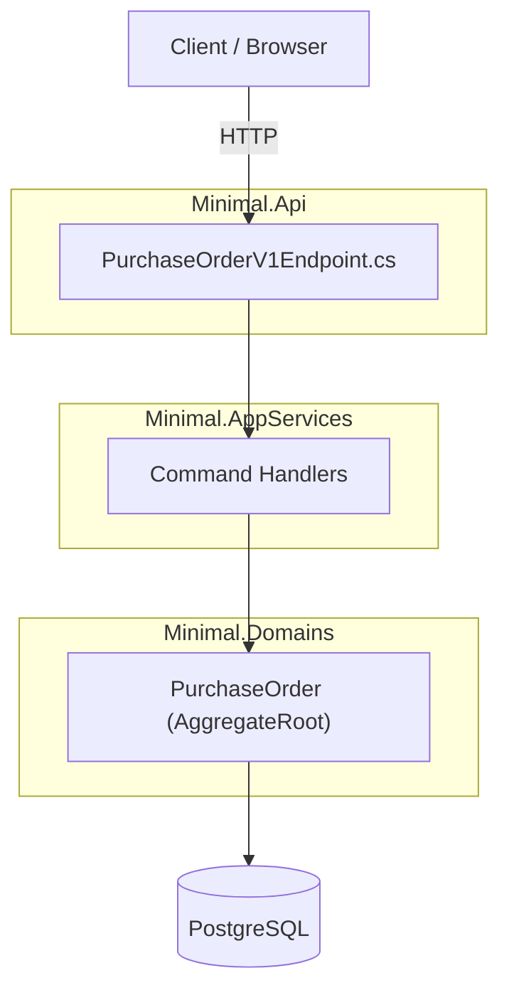
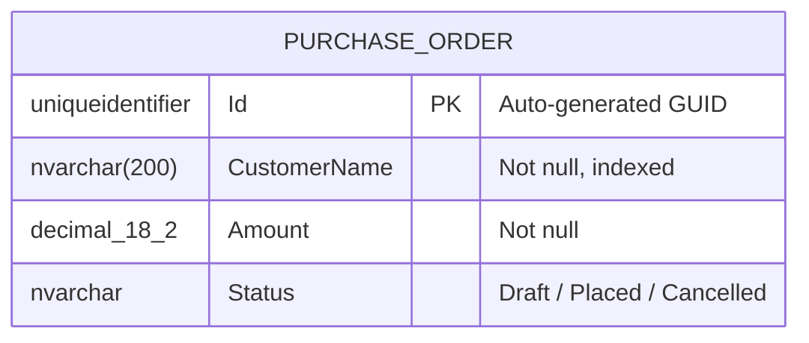

# Skill: Feature Documentation with Diagrams

**Duration**: 30–60 minutes | **Difficulty**: Beginner | **Category**: Documentation & Knowledge Management

---

## Overview

**When to use this skill**: After completing a feature (Domain Modeling → CRUD Operations → API Endpoints). Document it so any developer can understand, maintain, and extend the feature without digging through code.

**What you'll create**: Five structured markdown documents under `docs/features/<feature-name>/`:

| File | Purpose |
|------|---------|
| `README.md` | Overview, purpose, usage summary |
| `architecture.md` | Vertical slice diagram, component responsibilities, data flow |
| `api-reference.md` | All endpoints with request/response examples and curl commands |
| `data-model.md` | Entity diagram, properties, constraints, relationships |
| `events.md` | Domain events catalog with publishers and subscribers |

**Diagram tool**: All diagrams use **Mermaid.js** — rendered natively in GitHub, VS Code Preview, and most wikis. No extra tools required.

**Real examples already in this repo**: this skill is about documenting a *new* feature you just
built, not about the two worked samples that ship with the template — but those samples
(`ManualSample/PurchaseOrder` and `AutomatedSample/Product`) are the best current reference for what
"good enough to hand to another developer" looks like in this codebase. Skim their code before
writing your own docs — they show the level of detail and the "what does the developer give up"
framing this repo expects, even though the samples themselves don't ship their own per-feature docs
in the five-document structure below.

---

## Prerequisites: Do You Know This?

- [ ] Feature is implemented (Domain Entity, CRUD handlers, endpoints)
- [ ] Comfortable writing markdown
- [ ] Can read C# class definitions and extract relevant info
- [ ] Know what API endpoints were created (HTTP method, route, request/response)

---

## Inputs Checklist

Collect this before you start:

- [ ] **Feature name** (e.g., `PurchaseOrder`, `Product`, `Invoices`)
- [ ] **Purpose**: What business problem does it solve? (1–2 sentences)
- [ ] **Entity properties**: All fields with types and constraints
- [ ] **Entity relationships**: Foreign keys and navigation properties
- [ ] **API endpoints**: HTTP method, route, request/response shape
- [ ] **Domain events**: Names, publishers, subscribers
- [ ] **Business rules**: Validation, uniqueness, state transitions
- [ ] **Status/State model**: Does the entity have status fields? What are the transitions?

---

## Step-by-Step Workflow

### Step 1: Create the Feature Docs Folder

**Convention**: All feature docs must live in `docs/features/<feature-name>/`.

```bash
mkdir -p docs/features/purchase-orders
```

**Naming convention**:
- Folder name: `kebab-case` (e.g., `purchase-orders`, `order-management`)
- File names: lowercase with hyphens (e.g., `api-reference.md`, `data-model.md`)

---

### Step 2: Write README.md (Overview)

**What you're doing**: A self-contained landing page that answers: *what is this feature, why does it exist, and how do I use it?*

**Target audience**: Any developer new to the feature (including your future self).

Copy `templates/README-template.md` from this skill's folder and fill it in — What Is This?, Why Does It Exist?, Quick Start, Key Concepts, Feature Map, Related Documentation.

Example Quick Start entry (from the `PurchaseOrder` sample):

```http
POST /v1/purchase-orders
Content-Type: application/json
Authorization: Bearer {token}
X-Idempotency-Key: 6e6f4d3c-1b7e-4c7a-9f1d-8a2b5c6d7e01

{
  "customerName": "Acme Pte Ltd",
  "amount": 1250.00
}
```

---

### Step 3: Write architecture.md (Diagrams + Data Flow)

**What you're doing**: Show how the feature is structured across layers with a vertical slice diagram. Use Mermaid for all diagrams.

**Five diagrams to include**:

1. **Vertical Slice Overview** — All layers and their responsibilities
2. **Request Sequence Diagram** — How a POST (create) flows through the system
3. **Component Diagram** — Classes/files and their relationships
4. **State Diagram** — Status transitions (if entity has status field)
5. **Event Flow Diagram** — Domain events and consumers

Copy `templates/architecture-template.md` from this skill's folder and fill it in — Vertical Slice Overview, Sequence Diagram, Component Diagram, Status State Machine, Event Flow, Layer Responsibilities. Document only the transitions actual handler code performs in the State Machine — don't document an enum member as reachable just because it exists.

Example Vertical Slice Overview diagram (from the `PurchaseOrder` sample):



---

### Step 4: Write api-reference.md (Endpoint Reference)

**What you're doing**: Full endpoint documentation with curl examples, request/response schemas, and error codes.

Copy `templates/api-reference-template.md` from this skill's folder and fill it in — Endpoints Summary table, one section per endpoint (query params/request body, response, error table, curl example), Common Error Response Format. Note the pagination-defaults gotcha: a hand-written list query's `pageIndex`/`pageSize` defaults differ from the generated `MapGetList` route's contract (`pageNumber`/`pageSize` default 1/1000, configurable ceiling via `DKNet:ListQuery`, plus `fromDate`/`toDate` windowing) — document whichever contract this feature's route actually uses. Also document the standard error format: `result.Response()` (`DKNet.AspCore.Extensions.Responses`) converts a failed `FluentResults` result into `ProblemDetails` with messages under an `errors` array; a `NotFoundError` produces the same shape with `status: 404`.

Example endpoint entry (from the `PurchaseOrder` sample):

```markdown
## POST /v1/purchase-orders

Creates a new purchase order. **Requires** an idempotency key header.

| Field | Type | Required | Rules |
|-------|------|----------|-------|
| `customerName` | string | ✓ | 1–200 characters |
| `amount` | decimal | ✓ | Must be greater than 0 |

**Response** `201 Created` — a `PurchaseOrderDto` with `status: "Placed"`.
```

---

### Step 5: Write data-model.md (Entity Diagram)

**What you're doing**: Document the entity schema, constraints, relationships, and EF Core mapping config.

Copy `templates/data-model-template.md` from this skill's folder and fill it in — Entity Relationship Diagram, Properties table, EF Core Mapping Configuration (table/schema, indexes, enum storage, seed data), Validation Rules.

Example ER diagram (from the `PurchaseOrder` sample):



---

### Step 6: Write events.md (Domain Events Catalog)

**What you're doing**: Catalog all domain events published and consumed by this feature so other teams know how to subscribe.

Copy `templates/events-template.md` from this skill's folder and fill it in — Events Published (per event: publisher, payload, subscribers table, example handler usage), Events Consumed, Event Bus Configuration, Event Flow diagram.

Example event entry (from the `PurchaseOrder` sample):

```csharp
public sealed record PurchaseOrderCreatedEvent(Guid Id, string CustomerName, decimal Amount);
```

| Subscriber | Bus | Action |
|-----------|-----|--------|
| `PurchaseOrderCreatedEventHandler` | In-Memory | Logs at Information level |

---

## Document Naming Conventions

| Document | File Name | Description |
|----------|-----------|-------------|
| Overview + quick start | `README.md` | Always required |
| Architecture + diagrams | `architecture.md` | Required when using vertical slices |
| API endpoint reference | `api-reference.md` | Required for any REST-exposed feature |
| Entity + data model | `data-model.md` | Required for any persisted entity |
| Domain events | `events.md` | Required when events are published/consumed |
| Configuration guide | `configuration.md` | Optional — for features with settings/flags |
| ADR (decision records) | `decisions/adr-001-*.md` | Optional — when major tradeoffs were made |

---

## Mermaid Diagram Types Reference

Use appropriate Mermaid diagram types for different aspects:

| Diagram type | Mermaid keyword | When to use |
|-------------|-----------------|-------------|
| Component flow | `graph TD` / `graph LR` | Overview of layers, event flows |
| Request sequence | `sequenceDiagram` | How a specific API call flows step-by-step |
| Entity classes | `classDiagram` | Class relationships and properties |
| Entity-Relation | `erDiagram` | Database table structure |
| State machine | `stateDiagram-v2` | Status transitions |
| Timeline | `timeline` | Feature evolution, release history |

**All Mermaid diagrams are fenced code blocks**:

````md

````

They render automatically on GitHub, GitLab, VS Code (Markdown Preview), Docusaurus, and most modern wikis.

---

## Feature Docs Folder Structure

```
docs/
└── features/
    └── purchase-orders/          ← kebab-case folder name
        ├── README.md             ← Overview (START HERE)
        ├── architecture.md       ← Diagrams + vertical slice
        ├── api-reference.md      ← Endpoints + examples + curl
        ├── data-model.md         ← Entity diagram + constraints
        ├── events.md             ← Domain events + subscribers
        └── decisions/            ← Optional ADRs
            └── adr-001-idempotency-key-strategy.md
```
